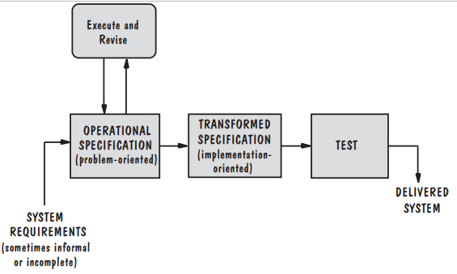
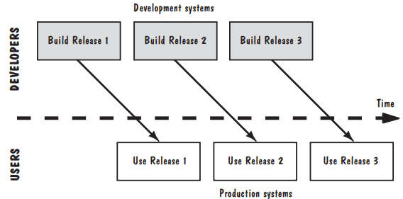
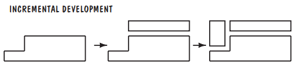
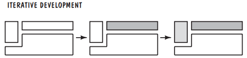
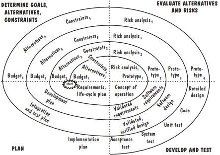

# 2_流程和生命周期建模

在本章中，可以了解到：
什么是“过程”
软件开发产品、过程和资源
软件开发过程的几种模型
用于流程建模的工具和技术

## 2.1_过程的意义（The Meaning of Process）

我们可以将一组有序的任务视为一个过程（process）：一系列步骤，涉及活动、约束和资源，以产生某种预期输出。
		当过程涉及到某些产品的构建时，我们有时将过程称为生命周期（life cycle）。
		因此，软件开发过程有时被称为软件生命周期（software life cycle），因为它描述了软件产品从概念到实现、交付、使用和维护的生命周期。
		所以，软件开发每个阶段本身就是一个过程（或过程集合），可以描述为一组活动。

### 该过程规定了所有主要过程活动

### 该过程使用资源，受制于一组约束条件，并生产中间产品和最终产品

### 过程可能由以某种方式链接的子过程组成。过程可以定义为过程的层次结构，其组织方式使每个子过程都有自己的过程模型

### 每个过程活动都有进入和退出标准，以便我们知道活动的开始和结束时间

### 活动按顺序组织，以便清楚地知道何时执行某一项活动

### 每个过程都有一套指导原则，解释每项活动的目标

### 约束或控制可能适用于活动、资源或产品。例如，预算或时间表可能会限制活动可能需要的时间长度，或者工具可能会限制资源的使用方式

## 2.2_软件过程模型（Software Process Models）

### 2.2.1_建模的原因

- 形成软件开发中涉及元素（活动、资源和约束）的共同理解
- 有助于开发团队发现流程及其组成部分中的不一致、冗余和遗漏
- 模型反映了团队的开发目标，可以在评估时确定是否实现
- 流程需要根据特殊情况进行定制，构建模型有助于理解在哪进行定制

### 2.2.2_瀑布模型（Waterfall Model）

首先提出的模型之一是瀑布模型，一个阶段应该在下一个阶段开始之前完成。
		因此，当所有需求都从客户那里获得、分析完整性和一致性并记录在需求文档中时，开发团队就可以继续进行系统设计活动。
		瀑布模型为开发过程中发生的事情提供了一个非常高级的视图，并向开发人员建议了他们应该遇到的事件的顺序。

- 过程

	- 需求分析（Requirements Analysis）
	- 系统设计（System Design）
	- 项目设计（Program Design）
	- 编码（Coding）
	- 单元&集成测试（Unit & Integration Testing）
	- 系统测试（System Testing）
	- 验收测试（Acceptance Testing）
	- 操作和维护（Operation & Maintenance）

- 问题

  瀑布模型最大的问题是它不能反映代码的实际开发方式。除了非常容易理解的问题外，软件的开发通常需要大量的迭代。
  		通常，软件用于解决以前从未解决过的问题，或者其解决方案必须升级以反映商业环境或运营环境的某些变化。

- 解决方案

	- 在每个阶段添加回溯到前面已完成阶段
	- 添加原型设计子过程

	  原型设计就是这样一个子过程；原型（prototype）是一种部分开发的产品，使客户和开发人员能够检查拟议系统的某些方面，并确定其是否适合或适合成品。
	  		设计原型可以帮助开发人员评估备选设计策略，并决定哪种策略最适合特定项目。
	  		通常，用户界面作为原型进行构建和测试，以便用户能够理解新系统的样子，设计师能够更好地了解用户喜欢如何与系统交互。
	  		因此，在系统测试期间，在需求正式验证之前，需求中的主要纠结已经得到解决和修复；验证（validation）确保系统已实现所有需求，以便每个系统功能可以追溯到规范中的特定需求。
	  		系统测试也验证了需求；验证（verification）可确保每个功能正常工作。

### 2.2.3_V 模型（V Model）

V模型是瀑布模型的一种变体，演示了测试活动如何与分析和设计相关（德国国防部，1992年）。
		单元和集成测试解决了程序的正确性。V模型表明，单元测试和集成测试也可以用来验证程序设计。
		也就是说，在单元测试和集成测试期间，编码人员和测试团队成员应确保程序设计的所有方面都已在代码中正确实现。
		同样，系统测试应验证系统设计，确保所有系统设计方面都得到正确实施。
		验收测试由客户而非开发人员进行，通过将测试步骤与规范的每个元素相关联来验证需求。
		这种类型的测试检查，以确保在系统被接受和支付之前，所有要求都已完全实现。

### 2.2.4_原型模型（Prototyping Model）

原型模型允许快速构建系统的全部或部分，以了解或澄清问题，其目标与工程原型相同，其中要求或设计需要反复调查，以确保开发人员、用户和客户对所需内容和建议内容有共同的理解。
		根据原型化的目标，可以消除原型化需求、设计或系统的一个或多个循环。
		然而，总体目标仍然是一样的：减少发展中的风险和不确定性。

### 2.2.5_操作规范（Operational Specification）

在操作规范模型（operational

specification model）中，以演示系统行为的方式评估或执行系统需求。
		也就是说，一旦指定了需求，就可以使用软件包来制定它们，以便在设计开始之前评估它们的影响。

### 2.2.6_转换模型（Transformational Model）

Balzer的转换模型（transformational model）试图通过取消几个主要的开发步骤来减少出错的机会。使用自动化支持，转换过程应用一系列转换将规范更改为可交付系统（Balzer 1981a）。
		示例转换可以包括
更改数据表示
选择算法
优化
编译

### 2.2.7_分阶段开发：增量和迭代（Phased Development: Increments and Iterations）

在软件开发的早期，客户愿意等待很长时间，等待软件系统准备就绪。有时，从编写需求文档到交付系统的时间之间会经过几年，称为周期时间（cycle time）。
		然而，今天的商业环境不再容忍长时间的延迟。软件有助于在市场上区分产品，客户总是在寻找新的质量和功能。
		因此，开发了新的过程模型，以帮助缩短周期时间。
		运营（operational）或生产系统（ production system）是客户和用户当前使用的系统，开发系统（development system）是正在准备的下一个版本，将取代当前的生产系统。
		通常，我们根据系统的版本号来参考系统：开发人员构建版本1，测试它，并将其作为第一个操作版本移交给用户。
		然后，当用户使用版本1时，开发人员正在构建版本2。
		因此，当版本n运行时，开发人员总是在开发n+1版。

- 增量开发（Incremental Development）

  在增量开发（incremental development）中，需求文档中指定的系统按功能划分为子系统。通过从一个小型功能子系统开始，然后在每个新版本中添加功能来定义这些版本。

- 迭代开发（Iterative Development）

  迭代开发（iterative development）从一开始就提供了一个完整的系统，然后在每个新版本中更改每个子系统的功能。

### 2.2.8_螺旋模型（Spiral Model）

螺旋模型更关注风险评估，每一次开发都是一个瀑布模型，但是添加了风险评估与风险分析。

### 2.2.9_敏捷方法（Agile Methods）

- 定义

	- 重视个人和互动，开发过程更注重面对面互动
	- 重视软件的正常工作程度，以此作为成功与否标准
	- 关注客户协作，让客户参与开发过程的关键方面
	- 专注于应对变化，而不是制定计划并遵循计划

- 原则

	- 极限编程（Extreme programming）

	  利用开发人员的创造力，最大限度地减少管理开销。

	- 结晶（Crystal）

	  基于以下概念的方法集合：每个项目都需要一组不同的政策、约定和方法。
	  		人对软件质量有着重要的影响，因此项目和过程的质量会随着相关人员质量的提高而提高。
	  		通过更好的沟通和频繁的交付，生产力得到了提高，因为对中间工作产品的需求减少了。

	- 良性竞争（Scrum）

	  它使用迭代开发，其中每30天的迭代被称为“冲刺”，以实现产品的优先需求积压。
	  		多个自组织、自治的团队并行实现产品增量。
	  		协调是在一个称为“scrum”的简短的每日状态会议上完成的。

	- 自适应软件开发（Adaptive Software Development）

	  自适应软件开发（ASD）有六个基本原则。
	  		有一个任务可以作为指导方针，设定目的地，但不规定如何到达目的地。
	  		功能被视为客户价值的关键，因此项目围绕建筑构件进行组织，以提供功能。
	  		迭代是重要的，所以重做是至关重要的。
	  		改变是被接受的，因此改变不是被视为一种纠正，而是对软件开发现实的调整。
	  		固定的交付时间迫使开发人员缩小所生成的每个版本的基本需求范围。
	  		同时，风险也被接受，因此开发人员首先要解决最困难的问题

- 极限开发实例

	- 规划游戏（The Planning Game）

	  用户编写关于系统应该如何工作的故事，然后开发人员估计实现这些故事所需的资源。这些故事描述了所涉及的参与者和行为。
	  		每个故事都涉及一个需求；只需要两句或三句话就可以足够详细地解释需求的价值，让开发人员能够指定测试用例和估计实现需求所需的资源。
	  		一旦编写了这些故事，潜在用户就会对需求进行优先排序，将其拆分和合并，直到就需要什么、可测试什么以及可用资源可以做什么达成共识。
	  		然后，计划人员生成每个版本的地图，记录版本包括什么以及何时交付。

	- 小型化发行版本（Small Releases）
	- 暗喻（Metaphor）

	  团队选择通用名称，并商定解决关键问题的通用方法。

	- 简单化设计（Simple Design）
	- 测试首先编写（Writing Tests First）

	  为了确保客户的需求是开发背后的驱动力，首先编写测试用例，以此迫使客户指定软件构建后可以测试和验证的需求。
	  		XP中使用了两种测试：由客户指定的功能测试和由开发人员和用户剪切的exe，以及由开发人员编写和运行的单元测试。

	- 重构（Refactoring）

	  重构（refactoring）是指重新审视需求和设计，重新制定它们以满足新的和现有的需求。
	  		有时重构解决了在不干扰系统外部行为的情况下重构设计和代码的方法。

	- 成对编程（Pair Programming）

	  成对编程试图解决软件开发的艺术方面，承认学徒-大师的隐喻在教授新手软件开发人员如何培养大师的直觉方面很有用。（你可以叫它导师一带一）

	- 集体所有制（Collective Ownership）

	  任何开发人员都可以在开发过程中更改系统的任何部分。

	- 持续集成（Continuous Integration）

	  快速交付功能意味着可以每天甚至每小时向客户承诺工作系统。
	  		重点是小幅度的增加或改进，而不是从一个版本到下一个版本的巨大飞跃。

	- 可持续发展

	  建议每周工作40小时，迫使开发人员投入大量时间来满足最后期限是一个信号，表明最后期限是不合理的，或者没有足够的资源来满足它们。

	- 现场客户（On-Site Customer）

	  理想情况下，客户应该在现场，与开发人员一起确定需求，并提供关于如何测试需求的反馈。

	- 编码标准

## 2.3_流程建模工具和技术（Tools and Techniques for Process Modeling）

在本章中，我们重点关注两大类，静态和动态。
		静态模型描述了该过程，表明输入被转换为输出。
		一个动态模型制定了流程，因此用户可以看到中间产品和最终产品是如何随时间变化的。

### 2.3.1_静态建模：Lai表示法（Static Modeling: Lai Notation）

- 活动（Activity）

  在一个过程中会发生的事情。这一要素可以与之前和之后发生的事情、需要什么资源、触发活动开始的因素、管理活动的规则、如何描述算法和经验教训以及如何将活动与项目团队联系起来有关。

- 顺序（Sequence）

  活动的顺序。可以使用触发器、编程构造、转换、排序或条件满足来描述序列。

- 流程模型（Process Model）

  关于系统的兴趣视图。因此，过程的各个部分可以表示为单独的模型，以预测过程行为或检查某些特性。

- 资源（Resource）

  必要的物品、工具或人员。资源可以包括设备、时间、办公空间、人员、技术等。流程模型确定了每个活动需要多少资源。

- 控制（Control）

  对过程制定的外部影响。控制装置可以是手动或自动、手动或机械控制。

- 策略（Policy）

  指导原则。这种高级流程约束会影响流程的制定。它可能包括规定的开发过程、必须使用的工具或强制的管理风格。

- 组织（Organization）

  流程代理的层次结构，物理分组对应逻辑分组和相关角色。从物理校准到逻辑分组的映射应该足够灵活，以反映物理环境的变化。

### 2.3.2_动态建模：系统动力学(Dynamic Modeling: System Dynamics)

要了解系统动力学是如何工作的，请考虑软件开发过程是如何影响生产率的。
		我们可以构建涉及开发人员时间的各种活动的描述性模型，然后查看模型中的更改如何增加或减少设计、编写和测试代码所需的时间。

## 2.4_实际过程建模（Practical Process Modeling）

### 2.4.1_映射案例研究（Marvel Case Studies）

研究人员使用映射规范语言MSL来定义流程，然后为其生成漫映射流程实施环境。
		MSL使用三种主要构造类、规则和工具封套来生成由三部分组成的流程描述：
基于规则的流程行为规范
模型信息处理的面向对象定义
一组接口，用于连接映射和用于执行流程的外部软件工具。

### 2.4.2_过程建模工具和技术的理想特性（Desirable Properties of Process Modeling Tools and Techniques）

- 促进人类理解和交流
- 支持流程改进
- 支持流程管理
- 在执行过程中提供自动指导
- 支持自动化流程执行
