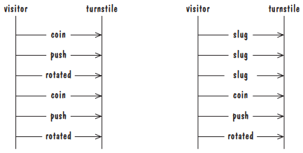
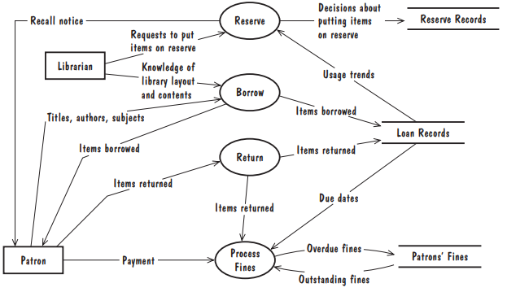

# 4_捕获需求

在本章中，可以了解到：
从客户那里获取需求
建模要求
审查要求以确保其质量
记录设计和测试团队使用的要求

## 4.1_需求流程（The Requirements Process）

需求（requirement）是期望行为的表达。需求涉及对象或实体、它们可以处于的状态以及为更改状态或对象特性而执行的功能。
		在规范（specification）阶段，我们将决定我们的软件系统将满足哪些需求（与专用硬件设备、其他软件系统或人工操作员或用户所满足的需求相反）。
		在设计（design）阶段，我们将设计一个如何实现指定行为的计划。
		执行这些任务的人通常被称为需求分析师（requirements analyst）或系统分析师（systems analyst）。

### 拟议软件系统需求的过程

- 启发（Elicitation）
- 分析（Analysis）
- 规格（Specification）
- 验证（Validation）
- 软件需求规范（Software Requirements Specification）

## 4.2_引出需求（Requirements Elicitation）

### 需求制定参与者

- 为要开发的软件付费的客户
- 软件开发后购买的客户
- 熟悉当前系统并将使用未来系统的用户
- 熟悉软件必须自动匹配的问题的领域专家
- 进行调查以确定未来趋势和潜在客户需求的市场研究人员
- 熟悉政府、安全或法律要求的律师或审计员
- 软件工程师或其他技术专家

### 其他方式

- 审查可用文件
- 观察当前系统
- 与用户交流
- 在小组中采访用户或利益相关者
- 使用特定领域的策略
- 与当前和潜在用户就如何改进推荐产品进行头脑风暴

## 4.3_需求类型（Types of Requirements）

### 4.3.1_需求分类

- 功能需求（Functional Requirement）

  功能需求（functional requirement）描述了所需活动方面的所需行为，如对输入的反应，以及活动发生前后每个实体的状态。

- 质量需求 / 非功能需求（Quality Requirement / Nonfunctional Requirement）

  质量需求（quality requirement）或非功能需求（nonfunctional requirement）描述了软件解决方案必须具备的一些质量特性，如快速响应时间、易用性、高可靠性或低维护成本。

- 设计约束（Design Constraint）

  设计约束（design constraint）是一种设计决策，例如平台或接口组件的选择，它已经做出，并且限制了我们问题的解决方案集。

- 流程约束（Process Constraint）

  流程约束（process constraint）是对可用于构建系统的技术或资源的限制。

### 4.3.2_解决冲突（Resolving Conflicts）

- 需求划分

	- 绝对必须满足的要求（基本要求）
	- 非常可取但不必要的要求（可取）
	- 可能但可以消除的要求（可选）

- 优点

	- 解决质量要求之间的冲突

- 其他方法

	- 确定并实现符合标准

### 4.3.3_两种需求文件（Two Kinds of Requirements Documents）

- 需求定义（Requirements Definition）

  需求定义是客户想要实现的一切的完整列表。

- 需求规范（Requirements Specification）

  需求规范将需求重新表述为拟定系统的行为规范。

## 4.4_需求特征（Characteristics of Requirements）

### 正确性（Correct）

我们和客户都应该审查文档要求，以确保它们符合我们对要求的理解。

### 一致性（Consistent）

也就是说，是否存在任何相互冲突的要求？
		例如，如果一项要求规定一次最多可以使用10个用户，而另一项要求规定在特定情况下可能同时有20个用户，则这两项要求被称为不一致。
		一般来说，如果无法满足这两个要求，则这两个要求是不一致（inconsistent）的。

### 明确性（Unambiguous）

如果需求的多个读者可以给出不同但有效的解释，那么需求是不明确的。假设卫星控制系统的客户要求精度足以支持任务规划。
		该要求没有告诉我们任务规划需要什么支持。客户和开发商可以对于所需的准确度有着截然不同的想法。
		进一步讨论“任务规划”的含义可能会导致更精确的要求：“在确定卫星位置时，位置误差应小于沿轨道50英尺，偏离轨道30英尺。”
		考虑到这一更详细的要求，我们可以测试位置误差，并确切知道是否满足要求。

### 完整性（Complete）

如果在所有可能的约束条件下，为所有可能状态下的所有可能输入指定了所需的行为和输出，则该需求集是完整（complete）的。
		如果所有状态、状态更改、输入、产品和约束都由某个需求描述，那么我们说这些需求是外部完整（externally complete）的。
		如果以下各项中没有未定义的术语，则需求描述是内部完整（internally complete）的。

### 可行性（Feasible）

也就是说，是否存在满足客户需求的解决方案？
		例如，假设客户希望用户能够访问位于数千英里之外的主计算机，远程用户的响应时间与本地用户相同（其工作站直接连接到主计算机）。
		当客户需要两个或两个以上的质量要求时，往往会出现可行性问题，例如要求使用廉价的系统来分析大量数据并在几秒钟内输出分析结果。

### 相关联性（Relevant）

有时，需求不必要地限制了开发人员，或者包含了与客户需求不直接相关的功能。
		例如，将军可能会决定坦克的新软件系统应允许士兵发送和接收电子邮件，即使坦克的主要目的是穿越崎岖的地形。
		我们应该努力保持“功能爆炸”得到控制，并帮助利益相关者专注于他们的基本和理想需求。

### 可测性（Testable）

如果这些要求建议进行验收测试，以清楚地证明最终产品是否符合要求，则这些要求是可测试的。
		考虑如何测试系统对查询提供实时响应的要求。我们不知道什么是“实时响应”。
		但是，如果给出了拟合标准，则表示系统应在不超过2秒钟的时间内响应查询，这样我们就可以确切地知道如何测试系统对查询的反应。

### 可追溯性（Traceable）

需求是否有组织，是否有唯一的标签以便于参考？需求定义中的每个条目是否在需求规范中都有相应的条目，反之亦然？

## 4.5_建模符号（Modeling Notations）

### 实体关系（ER）图（Entity-Relationship Diagrams）

实体关系图（entity-relationship diagram）（ER图）是一种流行的表示概念模型的图形符号范式。

- 统一建模语言类图（UML Class Diagrams）

  每个框都是一个类（class），表示类型相似的实体的集合，例如，一个类表示图书馆的所有图书。
  		一个类有一个名称（name），一组属性（attributes），这些属性是简单的数据变量，其值可以随时间变化，也可以在类的不同实体之间变化，以及对类属性的一组操作（operations）。

### 事件跟踪（Event Traces）

事件跟踪是真实实体之间交换的事件序列的图形化描述。

- 消息序列图（Message Sequence Chart）

  消息序列图是一种增强的事件跟踪符号，具有创建和销毁实体、指定动作和计时器以及合成跟踪的功能。

### 状态机（State Machines）

状态机（state machine）是系统及其环境之间所有对话框的图形化描述。每个节点，称为状态（state），表示事件发生之间存在的一组稳定条件。
		每个边，称为过渡（transition），表示由于事件的发生而导致的行为或条件的变化。
		每个转换都标有触发事件，可能还有一个输出事件，前面有符号“/”，在转换发生时生成。

- 统一建模语言状态图（UML Statechart Diagrams）

  UML状态图有丰富的语法，其中大部分借用了Harel最初的状态图概念（Harel 1987），包括状态层次、并发和机器间通信。
  		状态层次结构用于通过将具有公共转换的状态列选为超状态（superstates）来整理图表。

- 皮特里网（Petri Nets）

### 数据流图（Data-Flow Diagrams）

数据流图（data-flow diagram）（DFD）对功能和从一个功能到另一个功能的数据流进行建模。
		气泡表示转换数据的进程（process）或函数。箭头表示数据流（data flow），其中指向气泡的箭头表示气泡函数的输入，气泡外的箭头表示函数的输出之一。

- 统一建模语言用例图（Use Cases）

  UML用例图（use-case diagram）类似于高水平数据流图，它描述了系统与其环境之间交互方面的可观察的、用户发起的功能。
  		一个大框表示系统边界。
  		盒子外的木棍人物描绘了演员，包括人和系统，盒子内的每个椭圆形都是一个用例，代表一些主要的必需功能及其变体。
  		参与者和用例之间的一条线表示参与者参与了用例。
  		用例并不意味着对系统应该提供的所有任务进行建模。

### 功能和关系（Functions and Relations）

基于数学的规范和设计技术，称为形式化方法（formal methods）或途径（approaches），受到许多软件工程师的鼓励，他们构建了安全关键系统，即其故障会影响使用它们或附近人员的健康和安全的系统。
		一些形式范式将需求或软件行为建模为数学函数（functions）或关系（relations）的集合，当这些函数或关系组合在一起时，将系统输入映射到系统输出。

- 决策表（Decision Tables）

  决策表（decision table）（Hurley 1983）是功能规范的表格表示，将事件和条件映射到适当的响应或操作。

- 帕纳斯表（Parnas Tables）

  Parnas表（Parnas tables）这个短语实际上是指一组表类型和缩写策略，用于组织和简化函数表达式和关系表达式。
  		另一种表类型是倒排表，它看起来更像传统的决策表：case条件在行标题和表中指定为表达式条目和函数结果列在表的顶部或底部的列标题中。

### 逻辑（Logic）

操作（operational）符号是一种用于描述问题或提议的软件解决方案的符号，涉及情境行为：软件系统应如何响应不同的输入事件，计算应如何从一个步骤流向另一个步骤，以及系统在各种条件下应输出什么。
		逻辑（logic）由一种表示属性的语言和一组推理规则组成，这些规则用于从所述属性派生新的后续属性。
		在数学中，一个称为公式（formula）的逻辑表达式，根据公式中出现的变量值计算为真或假。

- 对象约束语言（Object Constraint Language）

  对象约束语言（OCL）试图创建一种约束语言，这种语言在数学上既精确，又便于非数学家（如客户）阅读、书写和理解。

- Z

  Z（发音为“zed”）是一种形式化的需求规范语言，它将变量的理论定义构造成问题的完整抽象数据类型模型，并使用逻辑来表示每个操作的前置和后置条件。
  		Z使用软件工程抽象将规范分解为可管理大小的模块，称为模式（Spivey 1992）。

### 代数规范（Algebraic Specifications）

查看系统的一种完全不同的方式是，在执行操作组合时会发生什么。
		这种多操作视图是代数规范（algebraic specifications）背后的主要思想：通过指定操作对之间的交互来指定操作行为，而不是建模单个操作。

- SDL 数据（SDL Data）

  SDL数据（SDL Data）定义用于在规范和描述语言（Specification and Description Language）（SDL）中创建用户定义的数据类型和参数化数据类型。

	- 生成器（Generators）

	  有助于构建定义数据类型的规范表示

	- 操纵器（Manipulators）

	  返回定义数据类型的值，但不是生成器

	- 查询（Queries）

	  不返回定义数据类型的值

## 4.6_需求和规范语言（Requirements and Specification Languages）

### 4.6.1_统一建模语言（Unified Modeling Language）

统一建模语言（Unified Modeling Language）（UML）（OMG 2003）是最为人所知的结合多种符号范式的语言。

- 用例图（Use-Case Diagram）
- 类图（Class Diagram）
- 时序图（Sequence Diagram）

  时序图是早期的行为模型，描述类实例之间传递的消息的跟踪。

- 协作关系图（Collaboration Diagram）

  协作图显示了一个或多个事件跟踪，这些跟踪覆盖在类图上。

- 状态图（Statechart Diagram）
- 对象约束语言属性（OCL Properties）

### 4.6.2_规范和描述语言（Specification and Description Language）

规范和描述语言（Specification and Description Language）（SDL）（ITU 2002）是国际电信联盟标准化的语言，用于精确指定通过无界消息队列相互通信的实时、并发、分布式进程的行为。

- SDL系统图
- SDL方框图
- SDL过程图
- SDL数据类型

  SDL数据类型定义用于声明复杂的、用户定义的变量类型。

### 4.6.3_软件成本降低（Software Cost Reduction）

软件成本降低（Software Cost Reduction）（SCR）（Heitmeyer 2002）是一系列技术的集合，旨在鼓励软件开发人员采用良好的软件工程设计原则。
		SCR规范将软件需求建模为数学函数REQ，该函数将监控变量（monitored variables）（系统感测的环境变量）映射到控制变量（controlled variables）（系统设置的环境变量）。

### 4.6.4_需求符号其他特征（Other Features of Requirements Notations）

## 4.7_原型设计需求（Prototyping Requirements）

### 快速原型（Rapid Prototyping）

快速原型涉及构建软件以回答有关需求的问题。

- 一次性原型（Throwaway Prototype）

  一次性原型（throwaway prototype）是为了解更多问题或建议的解决方案而开发的软件，它没有实现任何所需的功能，但很快就触及了我们对问题或拟议解决方案的核心问题。
  		一旦我们的问题得到回答，我们就扔掉原型软件，开始设计将要交付的软件。

- 可迭代原型（Evolutionary Prototype）

  可迭代原型（evolutionary prototype）是一种开发出来的软件，它不仅可以帮助我们回答问题，还可以整合到最终产品中。
  		因此，我们在开发时必须更加小心，因为该软件最终必须表现出最终产品的质量要求（例如，响应率、灵活性），而这些质量是无法改进的。

## 4.8_需求文档（Requirements Documentation）

### 4.8.1_需求定义（Requirements Definition）

首先，我们概述了该系统的一般目的和范围，包括相关利益、目标和目标。包括对其他相关系统的引用，我们列出了可能有用的任何术语、名称和缩写。
接下来，我们将介绍新系统提案的背景和基本原理。例如，如果系统要替换现有方法，我们将解释现有方法不令人满意的原因。目前的方法和程序都有足够详细的概述，以便我们能够将客户满意的因素与令人失望的因素区分开来。
一旦我们记录了问题的概述，我们将描述可接受解决方案的基本特征。该记录包括在用例级别对产品核心功能的简要描述。它还包括质量要求，如时间、精度和故障响应。理想情况下，我们将优先考虑这些需求，并确定那些可以推迟到系统的更高版本的需求。
作为问题背景的一部分，我们描述了系统将运行的环境。我们列出了拟议系统必须与之交互的任何已知硬件和软件组件。为了帮助确保用户界面适当，我们概述了预期用户的一般背景和能力，例如他们的教育背景、经验和技术专长。例如，我们将为知识型用户设计不同于首次用户的用户界面。此外，我们还列出了对需求或设计的任何已知约束，如适用法律、硬件限制、审计检查、监管政策等。
如果客户有解决问题的建议，我们将概述该建议的描述。但是请记住，需求文档的目的是讨论问题，而不是解决方案。我们需要仔细评估提出的解决方案，以确定它是要满足的设计约束，还是可能排除更好解决方案的过度规定。最后，如果客户对开发施加任何限制，或者如果需要做出任何特殊假设，则应将其纳入需求定义中。
最后，我们列出了我们对环境行为的任何假设。特别是，我们描述了可能导致拟定系统故障的任何环境条件，以及可能导致我们更改我们的要求。这些假设应该与需求分开记录，以便开发人员知道他们应该负责实现哪些行为。

### 4.8.2_需求规范（Requirements Specification）

在记录系统接口时，我们详细描述了所有输入和输出，包括输入的来源、输出的目的地、输入和输出数据的值范围和数据格式、控制某些输入和输出必须交换的顺序的协议、窗口格式和组织以及任何时间限制。请注意，用户界面很少是唯一的系统界面；系统可以与其他软件组件（例如，数据库）、专用硬件、互联网等进行交互。
接下来，我们根据接口的输入和输出重申所需的功能。我们可以使用函数表示法或数据流图将输入映射到输出，或者使用逻辑记录函数的前置条件和后置条件。我们可以使用状态机或事件跟踪来说明操作的精确序列或输入和输出的精确顺序。我们可以使用实体关系图将相关活动和操作收集到类中。最后，规范应该是完整的，这意味着它应该为任何可行的输入序列指定输出。因此，我们包括对输入的有效性检查，以及对异常情况（如违反前提条件）的系统响应。
最后，我们为每个客户的质量要求制定合适的标准，以便最终证明我们的系统是否满足这些质量要求。

### 4.8.3_过程管理和需求可追溯性（Process Management and Requirements Traceability）

- 流程管理

	- 定义系统应做什么的要求
	- 根据需求生成的设计模块
	- 实现设计的程序代码
	- 验证系统功能的测试
	- 描述系统的文件

- 需求可追溯性

  如果在开发的其余阶段对需求进行了任何更改，则可以从需求文档到设计过程，一直到测试程序，跟踪这些更改。
  		理想情况下，应该能够将系统的任何特征或功能追溯到其因果需求，反之亦然。

## 4.9_验证与核实（Validation and Verification）

### 4.9.1_前言

- 验证

  在需求验证中，我们检查我们的需求定义是否准确地反映了客户——实际上是所有涉众的需求。验证很棘手，因为只有少数文档可以作为证明需求定义正确的基础。

- 核实

  在核实中，我们检查一个文档或工件是否与另一个文档或工件一致。因此，我们核实我们的代码符合我们的设计，并且我们的设计符合我们的需求规范。
  		在需求级别，我们核实我们的需求规范是否符合需求定义。

- 总结

  总之，核实确保我们构建的系统正确，而验证确保我们构建正确的系统。

### 4.9.2_需求验证（Requirements Validation）

- 正确性（Correct）

  我们和客户都应该审查文档要求，以确保它们符合我们对要求的理解。

- 一致性（Consistent）

  也就是说，是否存在任何相互冲突的要求？
  		例如，如果一项要求规定一次最多可以使用10个用户，而另一项要求规定在特定情况下可能同时有20个用户，则这两项要求被称为不一致。
  		一般来说，如果无法满足这两个要求，则这两个要求是不一致（inconsistent）的。

- 明确性（Unambiguous）

  如果需求的多个读者可以给出不同但有效的解释，那么需求是不明确的。假设卫星控制系统的客户要求精度足以支持任务规划。
  		该要求没有告诉我们任务规划需要什么支持。客户和开发商可以对于所需的准确度有着截然不同的想法。
  		进一步讨论“任务规划”的含义可能会导致更精确的要求：“在确定卫星位置时，位置误差应小于沿轨道50英尺，偏离轨道30英尺。”
  		考虑到这一更详细的要求，我们可以测试位置误差，并确切知道是否满足要求。

- 完整性（Complete）

  如果在所有可能的约束条件下，为所有可能状态下的所有可能输入指定了所需的行为和输出，则该需求集是完整（complete）的。
  		如果所有状态、状态更改、输入、产品和约束都由某个需求描述，那么我们说这些需求是外部完整（externally complete）的。
  		如果以下各项中没有未定义的术语，则需求描述是内部完整（internally complete）的。

- 可行性（Feasible）

  也就是说，是否存在满足客户需求的解决方案？
  		例如，假设客户希望用户能够访问位于数千英里之外的主计算机，远程用户的响应时间与本地用户相同（其工作站直接连接到主计算机）。
  		当客户需要两个或两个以上的质量要求时，往往会出现可行性问题，例如要求使用廉价的系统来分析大量数据并在几秒钟内输出分析结果。

- 相关联性（Relevant）

  有时，需求不必要地限制了开发人员，或者包含了与客户需求不直接相关的功能。
  		例如，将军可能会决定坦克的新软件系统应允许士兵发送和接收电子邮件，即使坦克的主要目的是穿越崎岖的地形。
  		我们应该努力保持“功能爆炸”得到控制，并帮助利益相关者专注于他们的基本和理想需求。

- 可测性（Testable）

  如果这些要求建议进行验收测试，以清楚地证明最终产品是否符合要求，则这些要求是可测试的。
  		考虑如何测试系统对查询提供实时响应的要求。我们不知道什么是“实时响应”。
  		但是，如果给出了拟合标准，则表示系统应在不超过2秒钟的时间内响应查询，这样我们就可以确切地知道如何测试系统对查询的反应。

- 可追溯性（Traceable）

  需求是否有组织，是否有唯一的标签以便于参考？需求定义中的每个条目是否在需求规范中都有相应的条目，反之亦然？

### 4.9.3_核实（Verification）

在核实过程中，我们希望检查需求规范文档是否与需求定义文档相对应。

## 4.10_测量需求（Measuring Requirements）

## 4.11_选择规范技术（Choosing a Specification Technique）

### 适用性

### 可实施性

### 可测试性

### 可检查性

### 可维护性

### 模块化

### 抽象/表达水平

### 可靠性

### 可验证性

### 运行时安全

### 工具成熟度

### 松散

### 学习曲线

### 技术成熟度

### 数据建模

### 原则

*XMind: ZEN - Trial Version*