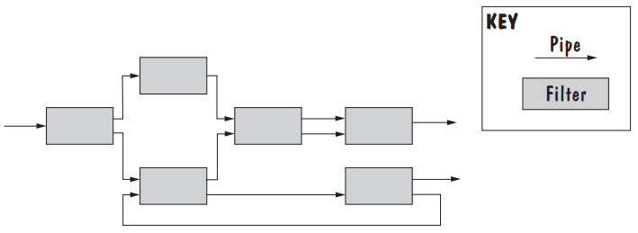
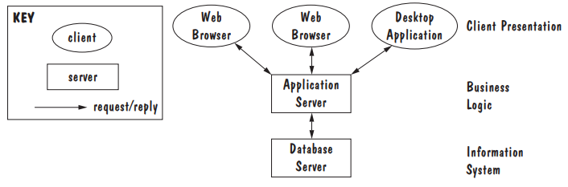
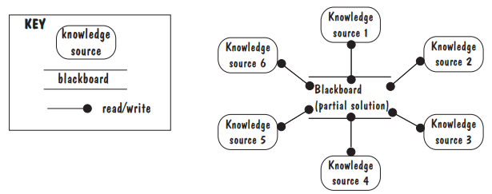
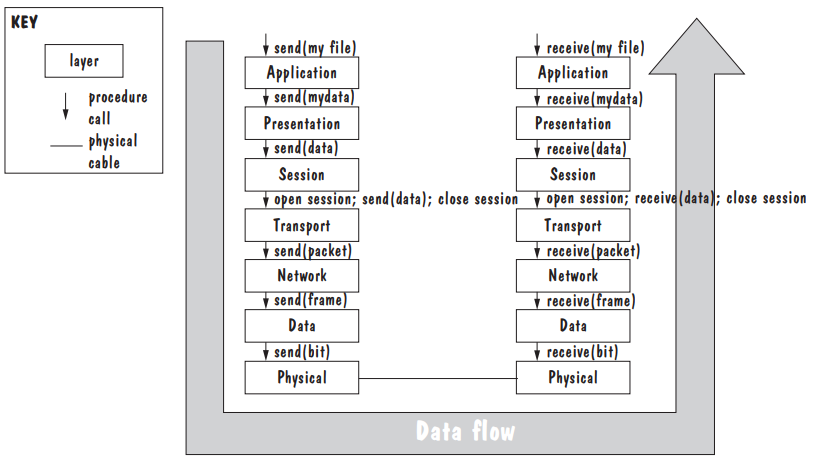
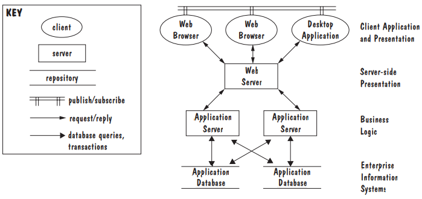
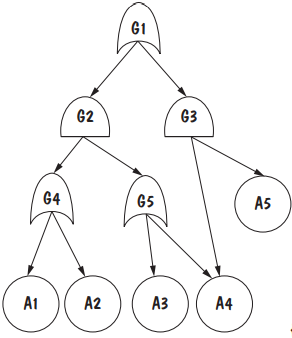
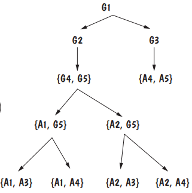

# 5_设计体系结构

在本章中，可以了解到：
软件架构视图
常见的架构模式
评估和比较设计备选方案的标准
软件架构文档

## 5.1_设计过程（The Design Process）

设计（design）是一个创造性的过程，找出如何实现客户的所有要求；最终的计划也称为设计。
		早期的设计决策涉及系统的架构（architecture），解释如何将系统分解为单元，单元如何相互关联，并描述单元的任何外部可见属性

### 5.1.1_设计是创造性过程（Design Is a Creative Process）

我们可以通过学习优秀设计的例子来提高我们的设计技能。大多数设计工作都是常规设计（routine design），其中我们通过重用和调整类似问题的解决方案。
		有许多方法可以利用现有的解决方案。
		一个极端是克隆（cloning），我们借用了整个设计，甚至是代码，进行了一些小的调整以适应我们的特定问题。
		稍微不那么极端的是，我们的设计基于一个参考模型（reference model）：一个针对特定应用领域的标准通用架构。
		软件架构也有通用的解决方案，称为架构样式（architectural styles）。

### 5.1.2_设计过程模型（Design Process Model）

- 建模（Modeling）

  尝试可能的分解

- 分析（Analysis）

  评估初步架构

- 文档（Documentation）

  记录体系结构决策

- 回顾（Review）

  检查我们的体系结构是否满足需求

- 软件架构文档（Software Architecture Document）

## 5.2_建模体系结构（Modeling Architectures）

### 使用原因

- 了解系统：它将做什么以及如何做
- 确定有多少系统将重用先前构建的系统元素，以及有多少系统将在未来重用
- 提供构建系统的蓝图，包括系统的“承重”部分可能位于何处（即稍后难以更改的设计决策）
- 思考系统可能如何发展，包括性能、成本和原型问题
- 分析相关性并选择最合适的设计、实施和测试技术
- 支持管理决策，了解实施和维护中固有的风险

## 5.3_分解和视图（Decomposition and Views）

### 5.3.1_架构分解

- 流行设计方法

	- 功能分解（Functional Decomposition）
	- 面向特征的设计（Feature-Oriented Design）
	- 面向数据的分解（Data-Oriented Decomposition）
	- 面向流程的分解（Process-Oriented Decomposition）
	- 面向事件的分解（Event-Oriented Decomposition）
	- 面向对象设计（Object-Oriented Design）

- 模块化（Modular）

  当系统的每个活动都由一个软件单元执行，并且每个软件单元的输入和输出定义良好时，设计就是模块化（modular）的。

- 定义良好（Well-Defined）

  如果软件单元的接口准确、精确地指定了单元的外部可见行为，那么软件单元就是定义良好的：每个指定的输入对单元的功能都是必不可少的，每个指定的输出都是单元操作的可能结果。

### 5.3.2_架构视图（Architectural Views）

- 分解视图
- 依赖关系视图
- 综合视图
- 执行视图
- 实施视图
- 部署视图
- 工作分配视图

## 5.4_架构风格和策略（Architectural Styles and Strategies）

### 管道-过滤器（Pipe-and-Filter）

- 定义

  管道是连接器，只需将数据从一个过滤器传输到下一个过滤器，而无需修改数据。每个过滤器都是一个独立的函数，它不对可能应用于数据的其他过滤器进行假设。
  		因此，我们可以通过将不同的过滤器连接在一起形成各种配置来构建我们的系统。
  		如果数据的格式是固定的，也就是说，如果所有过滤器和管道都假定传输的数据具有共同的表示形式，那么我们可以在任何配置中将过滤器连接在一起。

- 属性

  我们可以将系统从输入数据到输出数据的转换理解为过滤器数据转换的功能组成。
  过滤器可在任何其他管道和过滤器样式的程序中重复使用，该程序对输入和输出数据采用相同的格式。此类过滤器和系统的示例包括图像处理系统和Unix shell程序。
  系统迭代相对容易；我们可以简单地在系统配置中引入新的过滤器，或者更换或删除现有的过滤器，而无需修改系统的其他部分。
  由于过滤器独立性，我们可以执行某些类型的分析，例如吞吐量分析。
  使用管道和过滤器体系结构时会有性能损失。为了在数据传输期间支持固定的数据格式，每个过滤器必须在执行其计算之前解析输入数据，然后将其结果转换回固定的数据格式以供输出。这种重复的数据解析和分离可能会影响系统性能。它还可以使单个过滤器的构造更加复杂。

### C/S架构（Client-Server）

- 定义

  在客户机-服务器体系结构中，设计分为两种类型的组件：客户机和服务器。服务器（server）组件提供服务，客户端（clients）使用请求/应答协议（request/reply protocol）访问它们。这些组件并发执行，通常分布在多台计算机上。

### P2P架构（Peer-to-Peer）

- 定义

  从技术上讲，对等（peer-to-peer）（P2P）体系结构是这样一种体系结构，其中每个组件都作为自己的进程执行，并充当其他对等组件的客户端和服务器。
  		每个组件都有一个接口，该接口不仅指定它提供的服务，还指定它从其他对等组件请求的服务。

### 发布-订阅（Publish-Subscribe）

- 定义

  在发布-订阅体系结构中，组件通过广播和响应事件进行交互。组件通过订阅（subscribing）事件来表示对事件的兴趣。然后，当另一个组件宣布（发布[publishes]）事件已发生时，将通知订阅组件。
  		底层发布-订阅基础结构既可以注册事件订阅，也可以将发布的事件传递到适当的组件。
  		隐式调用（implicit invocation）是发布-订阅体系结构的一种常见形式，其中订阅组件将其一个过程与每个感兴趣的事件相关联（称为注册[registering]过程）。

- 区别

  与客户机-服务器和P2P组件相比，发布-订阅组件彼此一无所知。
  		相反，发布组件只是宣布事件，然后等待感兴趣的组件作出反应；每个订阅组件只对事件公告做出反应，而不管它们是如何发布的。

### 存储库（Repositories）

- 定义

  存储库（repository）风格的体系结构由两种类型的组件组成：中央数据存储和关联的数据访问组件。共享数据存储在数据存储中，数据访问器是存储、检索和更新信息的计算单元。
  		设计这样一个系统很有挑战性，因为我们必须决定这两种类型的组件将如何交互。
  		在传统数据库（traditional database）中，数据存储就像服务器组件一样，访问客户端的数据从数据存储请求信息，执行计算，并请求将结果写回数据存储。
  		在这样的系统中，数据访问组件是活动的，因为它们启动系统的计算。

- 黑板类型

  然而，在黑板（blackboard）类型的存储库中，访问数据的组件是反应性的：它们的执行是对数据存储的当前内容的反应。
  		通常，黑板包含有关系统执行的当前状态的信息，这些信息触发单个数据访问器（称为知识源[knowledge sources]）的执行。
  		例如，黑板可以存储计算任务，空闲知识源从黑板中检查任务，在本地执行计算，并将结果检查回黑板。

### 分层（Layering）

- 定义

  分层系统（layered systems）将系统的软件单元组织为多个层，每个层为其上一层提供服务，并充当其下一层的客户端。
  		在“纯”分层系统中，给定层中的软件单元只能访问同一层中的其他单元以及接口提供的服务。
  		为了提高性能，在某些情况下可以放宽此约束，允许一层访问其较低邻居下的层的服务；这称为层桥接（layer bridging）。

- OSI七层模型

### 组合架构风格（Combining Architectural Styles）

- 我们可能会在系统分解的不同级别使用不同的样式
- 架构可以使用混合的架构风格来建模不同的组件或组件之间不同类型的交互
- 如果风格兼容，则不同架构风格的集成更容易

## 5.5_质量属性实现（Achieving Quality Attributes）

### 可修改性（Modifiability）

- 策略：受软件变更直接影响的软件单元数量降至最低

	- 侧重

		- 对设计中的预期变更进行聚类

	- 方案

		- 预测预期的更改（Anticipate Expected Changes）

		  确定最有可能更改的设计决策
		  ，并将每个决策封装在自己的软件单元中。

		- 内聚性（Cohesion）

		  软件单元的各个部分、数据和功能都有助于单元的目的和职责。
		  		通过保持我们的软件单元高度的内聚性，我们增加了系统职责变更仅限于分配这些职责的少数单元的机会。

		- 通用性（Generality）

		  我们的软件单元越通用，我们就越有可能通过修改单元的输入而不是修改单元本身来适应变化。

- 策略：最小化对间接受影响的软件单元的影响

	- 侧重

		- 减少软件单元之间的依赖性

	- 方案

		- 耦合（Coupling）

		  通过降低耦合，我们减少了对一个单元的更改将波及其他单元的可能性。

		- 接口（Interfaces）

		  软件单元的接口揭示了单元的公共需求和责任，并隐藏了单元的私有设计决策。
		  		如果一个单元仅通过其接口与其他单元交互（例如，调用公共访问方法），那么对一个单元的更改不会扩展到单元边界之外，除非其接口更改（例如，如果方法签名、前提条件或后条件更改）。

		- 多接口（Multiple Interfaces）

		  经过修改以提供新数据或服务的单元可以使用新接口向单元提供数据或服务，而无需更改单元的任何现有接口。
		  		这样，对现有接口的依赖关系就不会受到更改的影响。

### 性能（Performance）

- 关注重点

  性能属性描述了对系统速度和容量的限制。

	- 响应时间（Response Time）
	- 吞吐量（Throughput）
	- 负载（Load）

- 提高性能策略

	- 资源利用率（Utilization of Resources）

		- 复制和分发共享数据
		- 增强软件并发能力

	- 管理资源分配（Manage Resource Allocation）

		- 先到先得
		- 明确的优先级
		- 最早截止日期优先

	- 减少对资源的需求（Reduce Demand for Resources）

		- 提高代码的效率
		- 以较低的频率获取传感器数据

### 安全（Security）

- 特征

	- 高免疫力（High Immunity）

		- 确保设计中包含所有安全功能
		- 最大限度地减少攻击者可能利用的安全漏洞

	- 高恢复力（High Resilience）

		- 分割功能，以便将攻击的影响控制在系统的一小部分
		- 使系统能够在短时间内快速恢复功能和性能

- 数据不安全行为

	- 用户意外共享包含敏感信息的文件或文件夹
	- 文件或数据错位
	- 用户界面不人性化，使得用户没有意识到文件正在共享
	- 文件或数据管理或组织不当
	- 用户依赖软件识别文件或数据类型并使其可用，而软件错误地包含了本应受到保护的文件或数据
	- 恶意软件在用户不知情的情况下共享文件或文件夹

### 可靠性（Reliability）

- 定义

  如果软件系统或单元在假定条件下正确执行其所需功能，则该系统或单元是可靠的（IEEE 1990）。

- 策略

	- 主动故障检测（Active Fault Detection）

		- 异常处理（Exception Handling）
		- 使用某种形式的冗余检测

		  例如，数据结构可以包括向前和向后指针，并且程序可以检查通过数据结构的路径是否一致。
		  		或者，会计程序可以将所有行和所有列相加，以验证合计是否相同。

	- 并行计算机进行诊断

	  在其他系统中，另一台并行运行的计算机用于监视主系统的进度和运行状况。第二个系统询问第一个系统，检查系统的数据和流程，寻找可能指示问题的迹象。
	  		例如，第二个系统可能会发现一个长时间没有调度的进程。此症状可能表示第一个系统在某个地方“卡住”，在某个过程中循环或等待输入。
	  		或者，系统可能会找到已分配且不再使用的存储块，但该存储块尚未在可用块列表中。或者，第二系统可以发现在传输结束时尚未释放的通信线路。
	  		如果第二个系统不能直接检查第一个系统的数据或进程，则可以启动诊断事务。

	- 故障恢复（Fault Recovery）

		- 撤消处理（Undoing Transactions）
		- 检查点/回滚（Checkpoint/Rollback）
		- 备份（Backup）
		- 降级服务（Degraded Service）
		- 更正并继续（Correct and Continue）
		- 汇报（Report）

### 健壮性（Robustness）

- 定义

  如果系统或单元能够“在无效输入或压力环境条件下”正确运行，则系统或单元是健壮的（IEEE 1990）。

- 策略

	- 软件单元相互怀疑机制

	  其中每个软件单元都假设其他单元存在故障。
	  		在此模式下，每个单元检查其输入的正确性和一致性，并测试输入是否满足单元的前提条件。

- 检测故障

  问题的来源于我们的软件环境中，而不是在我们自己的软件中。

### 可用性（Usability）

- 定义

  可用性属性反映了用户操作系统的容易程度。

- 用户界面决策

	- 用户界面应该位于自己的软件单元中，或者可能位于自己的体系结构层中
	- 有些用户启动的命令需要体系结构支持
	- 有一些系统启动的活动，系统应该为这些活动保留其环境的模型

### 业务目标（Business Goals）

- 购买还是构建（Buy vs. Build）
- 初始开发还是维护成本（Initial Development vs. Maintenance Costs）
- 新技术还是已知技术（New vs. Known Technologies）

## 5.6_协同设计（Collaborative Design）

### 外包（Outsourcing）

- 开发四个阶段

	- 项目是在一个场地上进行的，现场有来自国外的开发商。
	- 现场分析员将确定的系统需求提供给非现场的开发人员和程序员组开发
	- 非现场开发人员构建全球通用的产品和组件
	- 非现场开发人员利用各自的专业领域构建产品

- 缺陷

	- 时区差异
	- 不稳定的互联网连接
	- 外包团队与成熟子团队发生争吵
	- 外包团队不了解主开发所在地区商业规则、习俗和法律

## 5.7_架构评估与优化（Architecture Evaluation and Refinement）

### 5.7.1_测量设计质量（Measuring Design Quality）

- 一个类依赖于大量属于非祖先、后代或朋友类的属性，那么生成的代码比通常更容易出错
- 许多属于友元类的方法依赖于某个特定类的方法时，该类更容易出错

### 5.7.2_安全性分析（Safety Analysis）

- 故障树分析法（Fault-Tree Analysis）
- 切割集树（Cut-Set Tree）

### 5.7.3_保护措施分析（Security Analysis）

- 执行分析

	- 软件特性描述（Software Characterization）
	- 威胁分析（Software Characterization）
	- 脆弱性评估（Vulnerability Assessment）
	- 风险可能性确定（Risk Likelihood Determination）
	- 风险影响确定（Risk Impact Determination）
	- 风险缓解计划（Risk Mitigation Planning）

### 5.7.4_权衡分析（Trade-Off Analysis）

- 一种规格，多种设计（One Specification, Many Designs）
- 比较表（Comparison Tables）

### 5.7.5_成本效益分析（Cost–Benefit Analysis）

- 计算收益（Computing Benefits）
- 计算投资回报率（Computing Return on Investment）

### 5.7.6_原型设计（Prototyping）

## 5.8_记录软件体系结构（Documenting Software Architectures）

### 5.8.1_软件结构体系文档（Software Architectures Document）

- 系统概述（System Overview）

  本节介绍了系统的主要功能和用途。

- 视图（Views）

  从特定角度来看，每个视图都传达了有关系统总体设计结构的信息。除了视图之外，我们还记录了视图之间的关系。
  		因为这些观点很可能会被所有悲伤的读者阅读，所以每一节的开头都有一个观点及其主要要素和互动的摘要。
  		技术细节在单独的小节中讨论。

- 软件单元（Software Units）

  我们提供了待开发软件单元的完整目录，包括其接口的精确规格。
  		对于每个软件单元，我们指出单元作为元素出现在其中的所有视图。

- 分析数据和结果（Analysis Data and Results）

  本节包含有关系统架构、计算资源和执行环境的足够详细信息，以便设计分析师能够衡量设计的质量属性，还记录了分析结果。

- 设计理由（Design Rationale）

  必须对设计决策进行解释和辩护，并记录所选设计的理由，以确保项目经理和未来架构师无需重新审视最初因正当理由而被驳回的设计备选方案。

- 定义、词汇表、首字母缩略词（Definitions, Glossary, Acronyms）

  这些部分让所有读者对整个文档中使用的技术和领域词汇有相同的理解。

### 5.8.2_视图映射（Mappings among Views）

### 5.8.3_记录基本原理（Documenting Rationale）

除了设计决策之外，我们还记录了设计原理，概述了在生成设计时考虑的关键问题和权衡。

- 花了大量时间考虑各种选择并作出决定
- 决策对于实现需求至关重要
- 决策违反直觉或引发问题
- 改变决定的成本很高

## 5.9_架构设计评审（Architecture Design Review）

### 5.9.1_验证（Validation）

- 审查员

	- 帮助定义系统需求的分析员
	- 系统架构师
	- 本项目的程序设计师
	- 系统测试人员
	- 系统维护人员
	- 主持人
	- 记录人员
	- 其他未参与本项目的感兴趣的系统开发人员

- 审查内容

	- 建议的体系结构
	- 证明设计了具有需求文件规定的所需结构、功能和特征
	- 确认提出的设计包括所需的硬件、与其他系统的接口、输入和输出
	- 通过架构跟踪典型的执行路径确认通信和协调机制工作正常
	- 跟踪异常执行路径审查为检测故障和不良输入并从中恢复而采取的设计措施
	- 审查为预测可能的系统行为而进行分析的结果
	- 检查与质量属性相关的记录在案的设计原理

### 5.9.2_核实（Verification）

- 检查内容

	- 架构是否模块化、结构良好且易于理解
	- 能否改进架构的结构和可理解性
	- 架构是否可移植到其他平台
	- 架构的各个方面是否可重用
	- 架构是否支持易于测试
	- 架构是否在适当的情况下最大限度地提高了性能
	- 架构是否包含处理故障和防止故障的适当技术
	- 架构能否适应所有已记录的预期设计变更和扩展

## 5.10_软件产品线（Software Product Lines）

### 5.10.1_核心资产（Core Asset）

- 需求
- 软件架构
- 模型和分析结果
- 软件单元
- 测试
- 项目规划
- 团队组织

### 5.10.2_战略范围界定

### 5.10.3_产品线架构优势（Advantages of Product-Line Architecture）

- 部件更换（Component Replacements）
- 组件专门化（Component Specializations）
- 产品线参数（Product-Line Parameters）
- 架构扩展和收回（Architecture Extensions and Retractions）

### 5.10.4_产品线演变（Product-Line Evolution）

*XMind: ZEN - Trial Version*