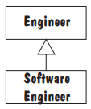
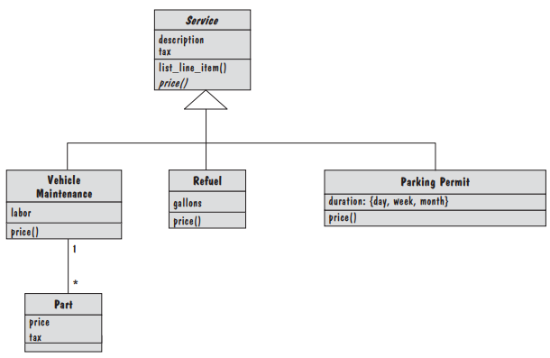

# 6_模块设计

在本章中，可以了解到：
设计原则
面向对象的设计启发式
设计模式
异常和异常处理
记录设计

## 6.1_设计方法学（Design Methodology）

当设计团队意识到已知的设计解决方案可能有用时，团队可能会切换到自下而上的设计方法。
		在这种方法中，它会尝试通过应用和调整预先打包的解决方案来处理部分设计。
		在一项名为重构（refactoring）的活动中，设计决策会定期重新审视和修订，以简化过于复杂的解决方案或优化特定质量属性的设计。

## 6.2_设计原则（Design Principles）

设计原则是将系统所需功能和行为分解为模块的指导原则。
		特别是，它们确定了我们应该以两种方式使用的标准：分解系统，然后决定在生成的模块中提供（和隐藏）哪些信息。
		设计原则在创造创新设计时很有用，但它们也有其他用途，尤其是在形成设计建议的基础时，这些建议被打包为设计惯例、设计模式，以及建筑风格。

### 模块化（Modularity）

模块化，也称为关注点分离，是将系统的各个不相关方面保持分离的原则，这样每个方面都可以单独研究。
		关注点可以是功能、数据、特性、任务、质量，或者我们想要更详细地定义或理解的需求或设计的任何方面。

- 耦合性（Coupling）

  我们说，当两个模块在很大程度上相互依赖时，它们是紧密耦合（tightly coupled）的。
  		松散耦合（loosely coupled）模块具有一定的依赖性，但它们的互连较弱。
  		未耦合（uncoupled）的模块根本没有互连；它们完全不相关。

	- 模块相互依赖

		- 从一个模块到另一个模块的引用

		  模块A可以调用模块B中的操作，因此模块A依赖模块B来完成其功能或过程。

		- 从一个模块传递到另一个模块的数据量

		  模块A可以传递参数、数组的内容或模块B的数据块。

		- 一个模块对另一个模块的控制量

		  模块A可以将控制标志传递给模块B。该标志的值告诉模块B某些资源或子系统的状态，要调用哪个过程，或者是否要调用某个过程。

	- 模块耦合性水平

		- 内容耦合

		  当一个模块导入到另一个模块、修改另一个模块的代码或分支到另一个模块的中间时，可能会发生内容耦合。

		- 公共耦合

		  对于公共耦合，很难确定哪个模块负责将变量设置为特定值。

		- 控制耦合

		  当一个模块传递参数或返回代码来控制另一个模块的行为时，我们说这两个模块之间存在控制耦合。

		- 标记耦合

		  当复杂的数据结构在模块之间传递时，我们说模块之间存在标记耦合。

		- 数据耦合

		  如果只传递数据值，而不传递结构化数据，则通过数据耦合连接模块。

		- 未耦合

- 内聚性（Cohesion）

  与衡量多个模块之间的相互依赖性不同，内聚性是指模块内部元素（如数据、函数、内部模块）内部和之间的依赖性。
  		模块的内聚性越强，其各个部分之间的联系就越紧密，并且与模块的单一目的的联系也就越紧密。

	- 模块内聚性水平

		- 巧合的（Coincidental）

		  最差的内聚性（巧合）出现在各部分彼此无关的模块中。

		- 逻辑的（Logical）

		  如果模块的各个部分仅由其代码的逻辑结构相关，则模块具有逻辑内聚性。

		- 时域性（Temporal）

		  有时，一个设计被划分为代表不同执行阶段的模块：初始化、读取输入、计算、打印输出和清理。
		  		这些模块中的内聚是暂时的，因为模块的数据和函数只有在执行过程中同时使用时才相关。

		- 程序性（Procedural）

		  当函数在一个模块中分组以封装其执行顺序时，我们说该模块在程序上是内聚的。

		- 通信（Communicational）

		  例如，可能会将不相关的数据收集在一起，因为这些数据是从同一个输入传感器收集的，或者是通过单个磁盘访问收集的。
		  		以这种方式围绕数据集设计的模块在通信上具有内聚性。

		- 功能的（Functional）

		  我们的理想是功能内聚，其中有两个条件：单个功能所必需的所有元素都包含在一个模块中，而该模块的所有元素都是该功能性能所必需的。
		  		功能内聚模块只执行其设计的功能，而不执行其他功能。

		- 信息性（Informational）

		  功能内聚对数据抽象和基于对象的设计的适应性被称为信息内聚。
		  		设计目标是一样的：只有当数据、动作或对象有一个共同的、合理的目的时，才将它们放在一起。

### 接口（Interfaces）

接口（interface）定义了软件单元向系统其余部分提供的服务，以及其他单元如何访问这些服务。
		例如，对象的接口是对象的公共操作和操作签名（signatures）的集合，它们指定每个操作的名称、参数和可能的返回值。

- 接口规范说明（Interface Specification）

	- 目的（Purpose）
	- 前提条件（Preconditions）
	- 协议（Protocols）
	- 后置条件（Postconditions）
	- 质量属性（Quality Attributes）

- 与内容耦合区别

  软件单元的接口也可以表示耦合的性质。
  		如果接口将对软件单元的所有访问限制为可以调用的访问函数集合，则不存在内容耦合。

### 信息隐藏（Information Hiding）

信息隐藏（Parnas 1972）旨在使软件系统更易于维护。
		信息隐藏原则的名称反映了结果：该单元的设计决策是隐藏的。

- 与分解方法的不同

  信息隐藏分解不同于第5章中列出的分解方法（例如，功能分解、面向数据的分解），
  		因为后者产生的软件单元只封装相同类型的信息（即，它们都封装了功能、数据类型或过程）。

- 要点

	- 确保接口本身不会涉及可能更改的设计方面

- 与内聚性联系

	- 隐藏数据表示的模块可能具有信息内聚性
	- 隐藏算法的模块可能具有功能内聚性
	- 隐藏任务执行顺序的模块可能具有程序内聚性

### 增量开发（Incremental Development）

- 使用图（Uses Graph）

	- 术语

		- Fan-In

		  表示使用特定软件单元的单元数。

		- Fan-Out

		  表示软件单元使用的单元数。

	- 原则

		- 低Fan-Out
		- 减少循环依赖

		  这种循环依赖并不一定是坏的。如果单元所解决的问题是自然递归的，那么设计中包含相互递归的模块是有意义的。
		  		但大周期限制了设计支持增量开发的能力：在开发周期的所有单元之前，无法开发周期中的任何单元（即，实现、测试、调试）。

### 抽象（Abstraction）

抽象是一种模型或表示，它省略了一些细节，以便可以关注其他细节。

### 通用性（Generality）

通用性是使软件单元尽可能普遍适用的设计原则，以增加其在未来系统中有用的可能性。

- 参数化特定于上下文的信息（Parameterizing Context-Specific Information）

  通过将软件运行所依据的数据制成参数，从而创建更通用的软件版本。

- 消除先决条件（Removing Preconditions）

  通过让软件在我们之前认为永远不会发生的条件下工作来消除先决条件。

- 简化后置条件（Simplifying Postconditions）

  通过将复杂的软件单元拆分为多个单元来减少后置条件，这些单元划分了提供后置条件的责任。
  		这些单元可以一起用于解决原始问题，也可以在只需要后条件的子集时单独使用。

## 6.3_面向对象设计（OO DESIGN）

### 原则

- 对象是唯一可识别的运行时实体，可以指定为消息或请求的目标。
- 对象可以组合，因为对象的数据变量本身可能是对象，因此封装了对象内部变量的实现。
- 可以通过继承重用和扩展对象的实现，以定义其他对象的实现。
- 面向对象代码可以是多态的：用通用代码编写，可以处理不同但相关类型的对象。相关类型的对象响应同一组消息或请求，但每个对象对请求的响应取决于对象的特定类型。

### 术语（Terminology）

- 对象、属性与方法

  OO系统的运行时结构是一组对象（objects），每个对象都是数据的内聚集合，以及创建、读取、更改和销毁这些数据的所有操作。对象的数据称为属性（attributes），其操作称为方法（methods）。

- 类、抽象类、子类与超类

  如果一个接口是提供另一个接口提供的服务的严格子集，我们就说第一个接口是第二个接口的子类型（subtype）。
  		同理，超类（supertype）即子类继承的类。
  		类（class）是部分或全部实现抽象数据类型的软件模块。如果一个类的某些方法缺少实现，我们就说它是一个抽象类（abstract class）。

- 构造函数

  此外，类定义包括生成新对象实例的构造函数（constructor）方法。

- 实例变量

  我们还有实例变量（instance variables），它们是程序变量，其值是对对象的引用。

- 多态性

  面向对象还支持多态性（polymorphism），即根据与接口的交互编写代码，但代码行为取决于运行时与接口关联的对象以及该对象方法的实现。

### 继承与对象组合（Inheritance vs. Object Composition）

- 继承
- 对象组合

### 可替代性（Substitutability）

- 子类支持父类的所有方法，并且它们的签名是兼容的
- 子类的方法必须满足父类方法的规范

	- 前提条件规则
	- 后置条件规则

- 子类必须保留父类的所有声明属性

### 得墨忒耳定律（Law of Demeter）

- 不与陌生人说话

### 依赖项反转（Dependency Inversion）

## 6.4_统一建模语言设计面向对象（Representing OO Design in the UML

### 6.4.1_过程中的UML（UML in the Process）

### 6.4.2_统一建模语言类图（UML Class Diagram）

- 寻找分割对象类项目

	- 活动人员（Actors）
	- 物理对象（Physical Objects）
	- 地点（Places）
	- 组织机构（Organizations）
	- 记录（Records）
	- 事务（Transactions）
	- 物品集合（Collections of Things）
	- 操作程序（Operating Procedures）
	- 由待构建系统操纵的事物（Operating Procedures）

- 指导原则

	- 哪些数据需要以某种方式“处理”
	- 哪些项目具有多个属性
	- 什么时候一个类中有多个对象
	- 哪些信息是基于需求本身，而不是从我们对需求的理解中获得的
	- 什么属性和操作总是适用于类或对象

- 获取行为

	- 祈使动词
	- 被动动词
	- 行动
	- 会员资格
	- 管理或所有权
	- 负责
	- 组织提供的服务

- 形成类图
- 关系

	- 泛化（Generalization）

		- 解释

		  泛化是继承关系的一种，子类继承父类的所有行为和属性，子类可以新增新的功能或者重写父类功能。

	- 实现（Realization）

		- 解释

		  实现是接口和类的关系，是指类实现了接口中定义的接口，uml中用带空心三角箭头的虚线。

	- 关联（Association)

	  在建模过程中必然存在类之间的联系，使类可以感知其他类的行为和属性，关联分为双向和单向关联。

		- 单向关联

			- 解释

			  对于一个单向关联来说也是两个类是相关的，但是只有一个类知道这种联系的存在。

		- 双向关联（标准）

			- 解释

			  对于双向关联来说被关联的两个类可以感知对方的存在。

	- 聚合（Aggregation）

		- 解释

		  聚合是关联关系的一种，聚合主要描述整体与部分直接的关系。需求陈述中常使用“包含”、“组成”、“分为…部分”等字句。
		  		除了基本（一般）聚集之外，还有共享聚集和组合聚集。

	- 组合（Composition)

		- 解释

		  组合聚合是聚合的一种特殊情况，成员对象与整体对象之间具有同生共死的关系，UML中使用一条从整体类到部分类的实线，并在整体类的关联末端画一个实心棱形标识 。

	- 依赖（Dependency)

		- 解释

		  依赖即一个类的实现需要其他类的协助，通常代码表现为方法参数，局部变量，静态方法调用，util类调用，uml中使用一条箭头的虚线，从依赖方指向被依赖的类。

	- 导航（Navigation）

### 6.4.3_其他UML图（Other UML Diagrams）

## 6.5面向对象设计模式（OO Design Patterns）

### 6.5.1_模板方法模式（Template Method Pattern）

抽象类定义了一个模板方法，该方法实现了操作的常见步骤，并声明了表示变化点的抽象基元操作。

### 6.5.2_工厂方法模式（Factory Method Pattern）

工厂方法模式用于封装创建对象的代码。通常，我们试图构造我们的设计，以便当模块与其他模块相关时，它们依赖于接口，而不是显式的类类型。
		工厂方法模式类似于模板方法模式。在这种情况下，类似但不完全相同的方法是实例化对象的构造函数方法。我们创建一个抽象类来定义抽象构造函数方法（工厂方法）。子类重写工厂方法来构造特定的具体对象。

### 6.5.3_策略模式（Strategy Pattern）

策略模式允许在运行时选择算法。当应用程序可以使用各种算法时，它很有用，但直到应用程序运行时，才知道最佳算法的选择。

### 6.5.4_装饰器模式（Decorator Pattern）

装饰器是它所修饰的对象的子类
装饰器包含对其装饰的对象的引用

### 6.5.5_观察者模式（Observer Pattern）

### 6.5.6_复合模式（Composite Pattern）

复合对象（composite object）是表示某个复合实体的对象的异构（可能是递归）集合。

### 6.5.6_访客模式（Visitor Pattern）

## 6.6_其他设计注意事项（Other Design Considerations）

### 6.6.1_数据管理（Data Management）

- 识别数据、数据结构以及它们之间的关系
- 设计服务以管理数据结构和关系
- 寻找数据库管理系统等工具来实现一些数据管理任务
- 设计类和类层次结构以监督数据管理功能

### 6.6.2_异常处理（Exception Handling）

### 6.6.3_设计用户界面（Designing User Interfaces）

- 确定将与系统交互的人员
- 为系统执行任务的每种方式定义场景
- 设计用户命令的层次结构
- 优化用户与系统交互的顺序
- 在层次结构中设计相关类，以实现用户界面设计决策
- 将用户界面类集成到整个系统类层次结构中

### 6.6.4_框架（Frameworks）

框架（framework）是针对特定应用程序域的大型可重用设计。
		例如，存在用于构建图形编辑器、web应用程序、以数据库为中心的系统、会计系统等的框架。

## 6.7_面向对象恒定标准（OO MEASUREMENT）

### 6.7.1_面向对象大小标准（OO Size Measures）

### 6.7.2_面向对象设计质量标准（OO Design Quality Measures）

### 6.7.3_哪里需要面向对象标准（Where to Do OO Measurement）

## 6.8_设计文档（Design Documentation）

在契约式设计（design by contract）中，每个模块都有一个接口规范，该规范精确地描述了模块应该做什么。Meyer（1997）认为，按合同设计有助于确保模块正确互操作。
		此规范称为契约（contract），用于控制模块如何与其他模块和系统交互。这种规范不能保证模块的正确性，但它为测试和验证提供了清晰一致的基础。该合同涵盖相互义务（先决条件）、利益（后决条件）和一致性约束（称为不变量[invariants]）。
		这些契约属性统称为断言（assertions）。

### 模块提供者

- 模块提供（至少）接口规范中公布的所有后条件、协议和质量属性
- 代码对其环境的要求不超过接口前提条件和协议中规定的内容

### 软件单元用户

- 代码仅在满足机组规定的前提条件和协议时使用机组
- 代码假设的关于单元行为的内容不超过其接口的后条件、协议和不变量中所述的内容
