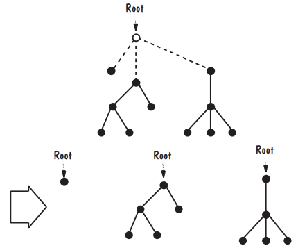
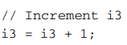
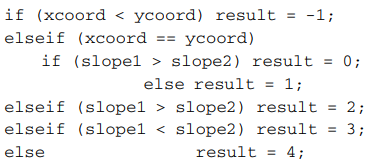

# 7_编写程序

在本章中，可以了解到：
编程标准
重用指南
使用设计来构建代码
内部和外部文件

## 7.1_编程标准和程序（Programming Standards and Procedures）

### 7.1.1_自己的标准（Standards for You）

- 帮助组织思想，避免错误
- 使代码清晰易懂
- 文档允许个人在工作中途离开并保存当时情况
- 有助于定位故障和进行更改
- 有助于将设计转化为代码
- 维护设计组件和代码组件之间的对应关系
- 错误的可能性也降到了最低

### 7.1.2_他人标准（Standards for Others）

您可能不是这些维护或测试团队的一部分，因此您必须组织、格式化和记录您的代码，以便于其他人了解它的功能和工作方式。
		在形成头部模块后，维护程序员阅读这样的块会发现需要更容易更改的组件。
		一旦找到该组件，如果数据名称清晰且接口定义良好，维护程序员可以确保所需的更改不会对代码的其他部分产生任何意外影响。
		同时，也可以使用自动化工具来分析代码，以确定此组件调用哪些过程以及哪些过程调用它。
		也就是说，工具生成的文档指向可以调用它的组件，向下指向过程调用的组件。
		有了这样的信息，对系统进行更改相对简单。

### 7.1.3_设计与实施相匹配（Matching Design with Implementation）

最关键的标准是程序设计组件和程序代码组件之间需要直接对应。
		如果设计的模块性没有被带入到代码中，那么整个设计过程就没有什么价值。设计特征，如低耦合、高内聚性和定义良好的接口，也应该是程序特征。
		这样算法、函数、接口和数据结构就可以很容易地从设计追溯到代码，再从代码追溯到设计。

## 7.2_编程指导原则

### 7.2.1_控制结构（Control Structures）

组件的许多控制结构是由体系结构和设计建议的，我们希望在将设计转换为代码时保留它们。
		对于某些体系结构，如隐式调用和面向对象设计，控制基于系统状态和变量变化。
		在其他更程序化的设计中，控制取决于代码本身的结构。对于任何类型的设计，程序结构都必须反映设计的控制结构。
		读者不必疯狂地浏览代码，标记要返回的部分，并怀疑他们是否遵循了正确的路径。他们应该专注于程序正在做什么，而不是控制流。
		因此，许多准则和标准建议编写代码，以便您可以轻松地自上而下读取组件。
		您的代码必须使读取器能够识别哪些参数（如果有的话）正在传递给组件并再次传递回来。
		否则，测试和维护将极其困难。换句话说，组件之间的依赖关系必须是可见的。
		同样，正如系统组件被设计为相互隐藏信息一样，程序的子组件应该相互隐藏计算细节。
		例如，在早期的字符串搜索程序中，文本搜索组件必须包含有关如何搜索指定字符的信息。但是调用组件不需要知道字符是如何找到的，只需要知道它是如何找到的以及它在哪里。
		这种信息隐藏允许您在不干扰其余代码的情况下更改搜索算法。

### 7.2.2_算法（Algorithms）

- 算法->代码

  程序设计通常指定一类算法，用于对正在编写的组件进行编码。例如，设计可能会告诉您使用快速排序，也可能会列出快速排序算法的逻辑步骤。
  		然而，在将算法转换为代码时，您有很大的灵活性，这取决于实现语言和硬件的限制。
  		您有很大酌处权的领域之一是实施的性能或效率。你的直觉可能会告诉你让代码尽可能快地运行。

- 隐藏成本

	- 编写速度更快的代码的成本，这可能更复杂，因此需要更多的时间来编写
	- 测试代码的时间成本，其复杂性需要更多的测试用例或测试数据
	- 用户理解代码的时间成本
	- 必要时修改代码的时间成本

### 7.2.3_数据结构（Data Structures）

- 保持程序简单
- 使用数据结构确定程序结构

  如果数据结构是通过识别初始元素，然后根据先前定义的元素生成连续元素来定义的，则称其为递归数据结构。
  		例如，根树是由节点和线组成的图，因此以下条件成立：
  树的一个节点被指定为根节点。
  如果从根发出的线被删除，则生成的图是一组不相交的图，每个图都是一棵有根树。

### 7.2.4_一般指导原则（General Guidelines）

- 本地化输入和输出（Localizing Input and Output）

  程序中读取输入或生成输出的部分是高度专业化的，必须反映底层硬件和软件的特性。
  		由于这种依赖性，执行输入和输出功能的程序部分有时很难测试。事实上，如果硬件或软件被修改，它们可能是最有可能改变的部分。
  		因此，希望将这些部分本地化为独立于代码其余部分的组件。

- 包括伪代码（Including Pseudocode）

  伪代码可用于使设计适应所选语言。通过采用构造和数据表示，而不必立即涉及每个命令的细节，您可以试验并确定哪种实现是最理想的。
  		通过这种方式，可以用最少的重写来重新排列和重构代码。

- 修改和重写，而不是打补丁（Revising and Rewriting, Not Patching）

  在编写代码时，例如在准备学期论文或创作艺术品时，您通常会写一个草稿。然后仔细修改和重写，直到对结果满意为止。
  		如果您发现控制流被扭曲，决策过程难以理解，或者无条件分支难以消除，那么可能是时候回到设计上来了。
  		重新检查设计，看看您遇到的问题是设计中固有的还是代码翻译中固有的。再看看数据是如何表示和构造的，所选的算法和分解。

- 重用（Reuse）

	- 生产者重用

	  在其中创建设计用于后续应用程序的组件.

		- 使用参数并预测与系统调用组件的条件类似的条件，使组件具有通用性
		- 分离依赖关系，以便将可能需要更改的部分与可能保持不变的部分隔离开来
		- 保持组件接口的通用性和良好定义
		- 包括有关发现和修复的任何故障的信息
		- 使用明确的命名约定
		- 记录数据结构和算法
		- 保持通信和错误处理部分分开，易于修改

	- 消费者重用

	  在其中使用最初为其他项目开发的组件。

		- 组件是否执行功能或提供您需要的数据
		- 如果需要轻微修改，修改是否比从头开始构建组件少
		- 组件是否有良好的文档记录，以便您无需逐行验证其实现就可以理解它
		- 是否有完整的组件测试和修订历史记录，以便您可以确定它不包含任何故障

## 7.3_文档（Documentation）

我们认为程序文档（program documentation）是一组书面描述，向读者解释程序做什么以及如何做。
		内部文档（internal documentation）是直接在代码中编写的描述性材料；所有其他文件均为外部文件（external documentation）。

### 7.3.1_内部文档（Internal Documentation）

内部文档包含针对将要阅读程序源代码的人的信息。
		因此，提供摘要信息以识别程序并描述其数据结构、算法和控制流。
		通常，这些信息放在每个组件的开头一组注释中（称为标题注释块[header comment block]）。

- 7.3.1.1_标题注释块（Header Comment Block）

	- 必要内容

		- 组件的名称
		- 谁编写了组件
		- 组件是否适合一般系统设计
		- 组件编写和修订的时间
		- 组件存在的原因
		- 组件如何使用其数据结构、算法和控件

	- 更多细节

		- 每个主要数据结构和变量的名称、类型和用途
		- 逻辑流程、算法和错误处理的简要描述
		- 预期输入和可能输出
		- 测试辅助工具及使用方法
		- 预期的扩展或修订

- 7.3.1.2_其他程序注释（Other Program Comments）

  虽然代码的清晰性和结构可以最大限度地减少对其他注释的需要，但如果可以将有用的信息添加到组件中，则附加注释非常有用。
  		除了逐行解释程序正在执行的操作外，注释还可以将代码分解为表示主要活动的阶段。
  		然后，每个活动可以划分为更小的步骤，每个步骤的长度只有几行。
  		程序设计中的伪代码可以用于此目的，并嵌入到代码本身中。
  		此外，在修改代码时，程序员应该更新注释以反映更改。

- 7.3.1.3_有意义的变量名和注释标签（Meaningful Variable Names and Statement Labels）
- 7.3.1.4_格式化以增强理解（Formatting to Enhance Understanding）
- 7.3.1.5_记录数据（Documenting Data）

### 7.3.2_外部文档（External Documentation）

- 描述问题（Describing the Problem）
- 描述算法（Describing the Algorithms）
- 描述数据（Describing the Data）

## 7.4_编程过程（the Programming Process）

### 7.4.1_编程以解决问题（Programming as Problem Solving）

- 寻找解决方案

	- 了解问题
	- 制定计划
	- 执行计划
	- 回顾

- 寻找正确计划

	- 确定相关问题

	  是否有数据、算法、库或方法可用于解决我们的问题？

	- 重申问题

	  关键定义是什么？问题是否可以一般化或更具体化，以使其更易于处理？可以简化假设吗？

	- 分解问题

	  问题的基本要素是什么？数据是否可以划分为多个类别，以便每个类别都可以单独处理？

### 7.4.2_极限编程（Extreme Programming）

- 客户

	- 定义程序员将实现的功能，使用故事描述系统的工作方式
	- 描述软件准备就绪时将运行的详细测试，以验证故事是否正确实施
	- 为故事及其测试分配优先级

- 开发人员

	- 编写代码来实现故事
	- 按照客户优先级指定的顺序进行
	- 估计编写每个故事所需的时间，以便客户能够计划验收测试
	- 计划以两周为增量进行，以便在客户和程序员之间建立信任

### 7.4.3_成对开发（Pair Programming）

在成对编程中，一对程序员使用一个键盘、显示器和鼠标。
		这对搭档中的每一个成员都扮演着非常特殊的角色。一个人是驾驶员或飞行员，控制计算机并实际编写代码。
		另一个人是导航员，查看驾驶员代码并提供反馈。两个团队成员定期交换角色。

### 7.4.4_在哪里编程（Whither Programming）

与几乎所有事情一样，答案可能是“一切都要适度”。

*XMind: ZEN - Trial Version*