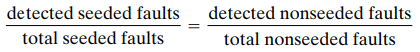
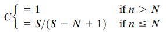

# 8_测试程序

在本章中，可以了解到：
错误类型和分类方法
测试目的
单元测试
集成测试策略
测试计划
何时停止测试

## 8.1_软件错误（Fault）和失败（Failures）

### 8.1.1_错误的种类（Types of Faults）

- 8.1.1.1_算法错误（Algorithmic Fault）

  因为组件的算法或者逻辑因过程步骤出现问题，从而无法对输入给出适当输出时，这个错误被称为算法错误。
  		有时通过通读程序代码（又叫桌面检查），或者提交期望程序在正常工作期间，收到的不同数据类型就非常容易发现。
  		典型的算法故障包括：
  分支处理太早
  分支处理太晚
  测试错误的条件
  忘记对变量进行初始化或设置循环常量
  忘记测试特定条件
  比较不同数据类型变量

- 8.1.1.2_语法错误（Syntax Faults）

  当检查算法错误时，也会寻找语法错误（syntax faults），希望确保正确使用编程语言构造。

- 8.1.1.3_计算（Computation）和精度错误（Precision Faults）

  当公式实现错误或者没有将结果计算到所需小数位时，会出现计算（computation）和精度错误（precision faults）。

- 8.1.1.4_文档错误（Documentation Faults）

  通常，程序实际操作与文档不匹配时，会将此问题说明为：程序存在文档错误（documentation faults）。
  		文档来自程序设计，清楚地描述了程序员希望程序如何工作，但功能实现可能存在缺陷，可能会导致程序错误的扩散，因为大部分开发人员可能会更加相信文档描述。

- 8.1.1.5_压力（Stress）或者超载故障（Overload Faults）

  需求规范文档通常会说明用户和设备的数量以及系统通信需求。通过使用这些信息，设计人员通常会定制系统特性，以处理不超过需求的最大负载。
  		但当数据结构内部填充超过指定容量时，会发生压力（stress）或者超载故障（overload faults）。

- 8.1.1.6_容量（Capacity）或边界故障（Boundary Faults）

  相似的，当系统性能因系统活动达到指定极限而变得不可接受，就会发生容量（capacity）或边界故障（boundary faults）。

- 8.1.1.7_计时（Timing）或协调错误（Coordination Faults）

  开发实时系统时，需要考虑关键因素：多个进程间协调同时运行，或者用仔细定义的顺序执行。
  		当未详细定义进程执行代码，则会造成计时（timing）或协调错误（coordination faults）。
  		这种错误极难复现并修正，由于计时和处理可能涉及很多因素，导致错误发生后，无法复现。

- 8.1.1.8_吞吐量（Throughput）或性能错误（Performance Faults）

  系统若无法以规定要求的速度运行，则会出现吞吐量（throughput）或性能错误（performance faults）。
  		这是不同类型的时间问题，它的时间限制取决于客户需求而不是系统内部协调需求。

- 8.1.1.9_恢复错误（Recovery Faults）

  虽然在开发过程中，整个团队已经谨慎的确保系统可以从故障中恢复过来。
  		但是，依旧有可能出现遇到故障时，无法按照设计人员意愿或客户要求恢复的状况出现，我们称它恢复错误（recovery faults）。

- 8.1.1.10_硬件（Hardware）或系统软件错误（System Software Faults）

  对于许多的系统，硬件与系统相关软件都会在需求文档中进行事先标注，它是否重用或者购买特定设计程序。
  		但是当提供的系统软件或者硬件无法按照记录的操作条件和程序工作时，我们称它为硬件（hardware）或系统软件错误（system software faults）。

- 8.1.1.11_标准（Standards）和程序错误（Procedure Faults）

  程序应遵守组织标准开发，若不遵守该规定，可能会导致测试与修改系统时发生错误。
  		通常，我们称这种问题为标准（standards）和程序错误（procedure faults）。
  		同时，由于未遵守开发标准，程序员之间理解各自的代码逻辑或查找解决问题所需数据描述会变得很困难。

### 8.1.2_正交缺陷分类（Orthogonal Defect Classification）

- 8.2.1.1_遗漏错误（A Fault of Omission）

  遗漏错误（A fault of omission）指代码缺失关键方面产生错误。

- 8.1.2.2_变量错误（A Fault of Commission）

  变量错误（A fault of commission）指变量被初始化为错误的值。

## 8.2_测试问题（Testing Issues）

### 8.2.1_测试组成（Test Organization）

- 8.2.1.1_单元测试（Unit Testing）

  首先，程序组件开发者进行自测，在自测过程中，该组件与系统其他组件隔离。我们一般称这种测试为模块测试（module testing）、组件测试（component testing）或单元测试（unit testing）。

- 8.2.1.2_集成测试（Integration Testing）

  对于通过单元测试的组件集合，下一步是确保组件之间接口得到正确定义和处理。
  		集成测试（integration testing）是验证系统组件是否协同工作的过程，如系统和程序设计规范所述。

- 8.2.1.3_功能测试（Function Test）

  当确定信息按照设计在组件之间传递，便会测试系统以确保它具有所需功能。
  		功能测试（function test）对系统进行评估，以确定需求规范中描述功能由集成系统实际执行。

- 8.2.1.4_性能测试（Performance Test）

  功能测试要求测试人员对正在构建的系统与开发人员需求规范描述的功能进行比较。
  		而性能测试（performance test）将系统与这些软件和硬件要求的其余部分进行比较。
  		当测试在客户实际工作环境正常运行后，它会经过验证系统（validation system）。

- 8.2.1.5_验收测试（Acceptance Test）

  性能测试完成后，开发人员可以确定系统会根据团队对系统描述的理解运行。
  		下一步是与客户联系以确保系统按照客户预期工作。团队将会与客户一起进行验收测试（acceptance test），根据客户需求描述检查系统。

- 8.2.1.6_安装测试（Installation Test）

  在验收测试完成后，系统将会安装在使用它的环境中，运行最终的安装测试（installation test），以确保系统正常运行。

### 8.2.2_对测试的态度（Attitudes Toward Testing）

在学习过程中，程序开发者普遍性根据老师给出规范进行编写并编译，以确定是否存在语法错误。
		此时，程序开发者可能只认为程序是解决问题，但并没考虑问题本身。在这种情况下，测试数据仅仅是在某些情况下展示了积极的结果，而并非没有错误。因此，这时候的测试仅仅是为了表明程序正常工作。
		而开发系统时不一样，客户更希望确保系统在所有条件下都能正常工作。
		因此，作为开发人员，目标应该是尽可能消除错误，无论谁发现或者谁创建。在这个条件下，更多软件工程师采取无自我编程（egoless programming）的态度，整个团队更关心如何纠正错误，而非责任归属问题。

### 8.2.3_进行测试人员（Who Performs the Tests?）

虽然系统使用无自我编程方式开发，但如果让开发人员进行自测，很难在测试过程中消除个人感受。
		因此，经常使用独立测试团队来参与开发过程中的审查和组合。这个团队可以参与需求与设计审查，可以单独测试代码组件，并可以测试系统是整体的，并将这个结果展现给客户以让客户验收。
		通过这种方式，测试可以与编程同时进行，在组件完成后对其进行测试，并将其拼凑在一起，而开发人员可以进行其他组件的开发。

### 8.2.4_测试对象看法（Views of the Test Objects）

在仔细研究单元测试之前，先考虑测试背后理念，当测试组件、组件集合、子系统和系统时，测试人员对测试对象的看法可能影响测试进行方式。
		决定如何测试时，可以选择使用黑盒和白盒两者，测试的方法可能取决于：
可能的逻辑路径数量
输入数据性质
涉及计算量
算法复杂度

- 8.2.4.1_黑盒（Black Box）

  如果测试人员从外部将测试对象视为内容未知的封闭盒（closed box）或者黑盒（black box），那测试就是将输入输入封闭框，并记录输出。
  		在这种情况下，测试确保提交了各种输入，并且观察到的输出与预期的输出相匹配。
  		但是，黑盒测试法虽然可以保证测试输出无错误，但输入的值一般都会选择有代表性的值而非所有可能的输入。
  		因此，仍旧有可能因为特定的条件或者输入，导致组件出现错误。

- 8.2.4.2_白盒（White Box）

  为了解决无法使用代表性用例验证所有用例正确性的问题，测试人员可以将测试对象视为一个打开的盒子（open box）（或称清晰盒子（clear box）或者白盒（white box））
  		这样，可以使用测试对象的结构以不同方式进行测试。
  		但是，由于可能出现递归或者迭代，这样的分支和循环组件很难进行彻底的测试。

## 8.3_单元测试（Unit Testing）

当想要开始单元测试时，首先先阅读代码，试图发现算法、数据和语法错误。
		接下来，将代码进行编译以消除剩余语法错误。
		最后，开发测试用例来显示输入是否正确转换为输出。

### 8.3.1_测试代码（Examining the Code）

由于设计描述可以帮助编写代码和记录程序，因此程序反映对设计的解释。文档用文字和图片解释程序在代码中应该做什么。
		因此，让客观的专家组将审查代码及文档是否有误解、不一致和其他错误是很有用的，这被称为代码审查（code review）。
		代码审查专家组一般包含其他程序员、设计师、技术专家和项目主管。

- 8.3.1.1_代码演练（Code Walkthroughs）

  代码审查包含演练和检查。
  		在演练（walkthrough）中，审查团队将根据开发人员对代码和随附文档的展示，进行正确性的评论。
  		在这个过程中，更多的关注在代码上而非编码器上，希望发现错误而非修复它。

- 8.3.1.2_代码检查（Code Inspection）

  代码检查比起演练更加正式，审查小组根据清单检查代码和文档。
  		通常，检查（inspection）涉及几个步骤。
  		首先，团队分组开会，概述代码并描述检查目标。然后，团队成员单独准备第二次小组会议，每个调查员研究代码及其相关文档，并注意发现的错误。最后，在小组会议上团队成员报告发现，并记录错误。

- 8.3.1.3_代码审查的成功（Success of Code Reviews）

  代码审查使得错误发现的比以往在测试中才发现更早，因此错误的纠正更加的容易，成本也越低。

### 8.3.2_验证代码正确（Proving Code Correct）

在代码经过开发、自测和团队审查后，测试下一步是用更有条理方式对代码进行审查，确保正确性。
		程序若如设计所示正确实现功能和数据，并且与其他组件正确接口，则该程序正确。

- 8.3.2.1_正式证明技术（Formal Proof Techniques）

  正式证明技术用以下方式运作：
  使用断言来描述组件输入输出情况；
  绘制流程图描述组件逻辑流程；
  使用断言对状态转换进行证明；
  对逻辑循环进行断言；
  确定每一条路径；
  确定输出断言来验证；
  证明程序。

- 8.3.2.2_正确性证明优缺点（Advantages and Disadvantages of Correctness Proofs）

  通过这种方式，可以发现代码中算法错误，并检查潜在逻辑结构，使得在指定数据、数据结构和算法规则时更加严格和精确。
  		但是，这种方法可能会使得在验证大型、复杂组件时，需要巨大逻辑图、更多转换和大量路径验证。

- 8.3.2.3_符号执行（Symbolic Execution）

  符号执行（symbolic execution）涉及使用符号而非数据变量模拟代码执行。
  		这种方式仅考虑等效性数据类别作为符号发送，大大减少用例数量，但耗时太长，且对下标和指针划分等效类困难。

- 8.3.2.4_自动化定理证明（Automated Theorem Proving）

  软件工程师试图实现自动化，通过开发将以下几点读取为输入的工具来证明程序正确的过程：
  输入数据和条件
  输出数据和条件
  待测试组件代码行

### 8.3.3_测试程序组件（Testing Program Components）

- 8.3.3.1_测试与证明比较（Testing vs. Proving）

  证明告诉我们一个程序将如何在假设环境中工作设计和需求。
  		测试为团队人员提供了有关程序如何在其实际操作环境中工作的信息。

- 8.3.3.2_选择测试用例（Choosing Test Cases）

  测试点（test point）或测试用例（test case）是用于测试程序的特定输入数据选择。
  		测试是测试用例的有限集合。我们如何选择测试用例和定义测试为了让我们自己和我们的客户相信程序工作正常，而不是仅针对测试用例。

- 8.3.3.3_测试彻底性（Test Thoroughness）

  为了彻底测试代码，我们可以至少使用以下几种测试用例中的一种来选择基于代码的方法。

	- 语句测试（Statement Testing）

	  语句测试：对组件中的每句语句进行测试。

	- 分支测试（Branch Testing）

	  分支测试：对于代码中的每个决策点，至少选择每个分支进行一次测试。

	- 路径测试（Path Testing）

	  路径测试：通过代码的每个不同路径进行测试。

	- 定义使用路径测试（Definition-use Path Testing）

	  定义使用路径测试：从每个变量的每个定义到该定义的每次使用都是在某个测试中进行的。

	- 所有用途测试（All-uses Testing）

	  所有用途测试：测试集至少包括一条从每个定义到这一定义所能达到的每一个用途。

	- 所有谓词使用/一些计算使用测试（All-predicate-uses/Some-computational-uses Testing）

	  所有谓词使用/一些计算使用测试：针对每个变量和定义该变量时，测试至少包括一条从定义到每个谓词使用；如果该说明中未包含定义，则包括计算用途，以便涵盖所有定义。

	- 所有计算用途/一些谓词用途测试（All-computational-uses/Some-predicate-uses Testing）

	  所有计算用途/一些谓词用途测试：针对每个变量和定义该变量时，测试至少包括一条从定义到每次计算使用；如果该说明中未包含定义，然后包括谓词使用，以便涵盖每个定义。

### 8.3.4_比较技术（Comparing Techniques）

## 8.4_集成测试（Integration Testing）

### 8.4.1_自底向上集成（Bottom-Up Integration）

自底向上测试（bottom-up testing）是测试更大系统的一种流行方法。
		使用此方法时，首先单独测试位于系统底层的模块。然后，接下来要测试的组件是那些底层与上层被调用的模块。
		重复使用此方法，直到测试中包括所有的组件。

### 8.4.2_自顶向下集成（Top-Down Integration）

许多开发人员更喜欢使用自顶向下的方法（top-down approach），而在许多方面与自底向上恰恰相反。
		顶层通常是一个控制组件，由其自身进行测试。然后下一层组件与上层调用组件形成集合，进行测试，直到所有组件都被集成测试。

### 8.4.3_改进的自顶向下集成（Modified Top-Down Integration）

自顶向下测试需要开发辅助测试模块——桩模块以帮助测试上层驱动模块。
		虽然可以验证早期的顶层驱动组件，但是对于桩模块可能产生的问题以及底层模块存在测试不够充分的问题未能解决。
		因此对自顶向下集成进行了改进，当需要集成下一层模块进行测试之前，先对其进行单独测试，再集成到一起进行测试。

### 8.4.4_大爆炸集成（Big-Bang Integration）

当所有组件都被单独测试后，再将它们混合在一起作为最终系统，并观察它第一次是否工作。
		迈尔斯（1979）将这种测试称为大爆炸测试（big-bang testing）。

### 8.4.5_三明治集成（Sandwich Integration）

迈尔斯（1979）将自上而下的策略与自下而上的策略相结合，形成三明治测试（sandwich
 testing）方法。
		该系统被视为三层，就像三明治：目标中间层、目标层上方的层次和目标层下方的层次。
		顶层采用自上而下的方法，下层采用自下而上的方法。测试收敛于目标层，根据系统特性和组件层次结构进行分析。

### 8.4.6_改进的三明治集成（Modified Sandwich Testing）

然而，在集成之前，三明治测试方法不会彻底测试各个组件。
		修改后的三明治测试允许更高水平组件与其他组件合并之前，先进行单独的测试，再进行集成测试。

## 8.5_测试面向对象系统（Testing Object-Oriented Systems）

### 8.5.1_测试代码（Testing the Code）

对于如何测试面向对象系统，有以下几个问题：
当需要唯一值时，系统能否生成这个唯一结果；
当存在多个可能值，是否有方法选择唯一结果；
是否有未处理的有用用例。
		此外，需要检查对象和类本身是否出现过度或者不足：缺失对象、不必要的类、缺少或者不必要的关联，或者关联或属性位置不正确。
		其次，测试期间需要注意并发和同步问题，并保证响应时间完整且一致。

### 8.5.2_面向对象与传统测试区别（Differences between Object-Oriented and Traditional Testing）

Graham（1996a）从两个方面总结了面向对象测试和传统测试之间的差异。
		首先，她指出了面向对象的哪些方面测试更容易，这使得测试更困难。例如，对象往往很小，通常存在于组件中的复杂性往往被推向组件之间的接口。
		这种差异意味着单元测试不那么困难，但集成测试必须更加广泛。正如我们所看到的，封装通常被认为是面向对象设计的一个积极属性，但它也需要更广泛的集成测试。
		类似地，继承引入了对更多测试的需求。继承的函数需要额外测试，如果：
重新定义；
它在派生类中具有特定行为；
该类中的其他功能应该是一致的。

- 面向对象测试更简单的部分（Easier Parts of Testing Object-Oriented Systems）

	- 模块化（Modularity）
	- 快速开发（Quicker Development）
	- 小型方法（Small Methods）
	- 重用（Reuse）
	- 已识别早期接口（Interfaces Identified Early）

- 面向对象测试更困难的部分（Harder Parts of Testing Object-Oriented Systems）

	- 继承（Inheritance）
	- 多态（Polymorphism）
	- 动态绑定（Dynamic Binding）
	- 复杂接口（Complex Interfaces）
	- 更多集成（More Integration）

## 8.6_测试计划（Test Planning）

正如我们所看到的，测试组件和集成组件以构建系统涉及的内容很多。
		仔细的测试计划有助于我们设计和组织测试，因此我们相信我们应该进行适当和彻底的测试，同时必须规划测试过程的每个步骤。

### 8.6.1_测试步骤

- 建立测试目标（Establishing Test Objectives）
- 设计测试用例（Designing Test Cases）
- 编写测试用例（Writing Test Cases）
- 测试测试用例（Testing Test Cases）
- 执行测试用例（Executing Tests）
- 评价测试结果（Evaluating Test Results）

### 8.6.2_计划目的（Purpose of the Plan）

团队使用测试计划来组织测试活动。
		测试计划考虑了测试目标，并纳入了测试策略或项目截止日期规定的任何时间表。系统开发生命周期需要多个级别的测试，从单元和集成测试开始，然后再演示整个系统的功能。
		测试计划（test plan）描述了团队向客户展示软件正常工作的方式（即，软件无故障，并按照要求执行功能）。
		因此，测试计划不仅涉及单元和集成测试，还涉及系统测试。该计划是整个测试活动的指南。它解释了谁进行测试、为什么进行测试、如何进行测试以及何时安排测试。
		为了制定测试计划，团队必须了解系统设计和代码的需求、功能规范和模块层次结构。
		在开发这些系统元素的过程中，团队可以将团队所知道的应用于选择测试目标、定义测试策略和生成一组测试用例。
		因此，测试计划是随着系统本身的开发而开发的。

### 8.6.3_计划内容（Contents of the Plan）

当测试团队能够意识到测试目标已经实现时，可以说测试目标定义明确（well-defined）。
		然后，当决定如何将组件集成到工作系统中。团队在组件级水平考虑语句、分支和路径覆盖，以及集成级的自顶向下、自下而上和其他策略。
		将组件合并为一个整体的最终计划有时也称为系统集成计划（system integration plan）。

## 8.7_自动化测试工具（Automated Testing Tools）

### 8.7.1_代码分析工具（Code Analysis Tools）

- 8.7.1.1_静态分析（Static Analysis）

	- 代码分析器（Code Analyzer）

	  自动评估组件的语法是否正确。

	- 结构检查器（Structure Checker）

	  此工具根据提交的组件作为输入生成图形，该图描述了组件逻辑流程，检查结构缺陷。

	- 数据分析器（Data Analyzer）

	  该工具检查数据结构、数据声明和组件接口，然后指出组件之间的不当链接、数据定义冲突和非法数据使用。

	- 序列分析器（Sequence Checker）

	  该工具检查事件序列；如果序列顺序错误，事件将突出显示。

- 8.7.1.2_动态分析（Dynamic Analysis）

  很多时候，因为多个并行操作同时执行导致系统很难测试，这种情况对于实时系统尤其如此。
  		在这个情况下，很难预测条件并生成具有代表性的测试用例。
  		自动化工具使测试团队能够通过保存条件的“快照”来捕获程序执行期间的事件状态。
  		这些工具有时被称为程序监视器（program monitors），因为它们监视并报告程序的行为。

### 8.7.2_测试执行工具（Test Execution Tools）

- 8.7.2.1_捕获和回放（Capture and Replay）

  捕获和回放（capture-and-replay）或捕获和回放（capture-and-playback）工具在测试运行时捕获击键、输入和响应，并将预期结果与实际结果进行比较，将差异报告给团队，捕获的数据有助于团队追溯差异的根本原因。
  		在发现并修复故障后，这种工具尤其有用，它可用于验证修复程序是否已更正故障，而不会在代码中引入其他故障。

- 8.7.2.2_存根和驱动器（Stubs and Drivers）
- 8.7.2.3_自动化测试环境（Automated Testing Environments）

### 8.7.3_测试用例生成器（Test Case Generators）

## 8.8_什么时候停止测试（When to Stop Testing）

### 8.8.1_错误播种（Fault Seeding）

Mills（1972）开发了一种称为错误播种（fault seeding）或错误播种（error seeding）的技术来估计程序中的错误数量。
		基本前提是测试团队的一个成员故意在程序中插入（或“种子”）已知数量的错误。
		然后，其他团队成员定位尽可能多的错误。未发现的种子错误数作为程序中剩余错误总数（包括本地错误、非种子错误）的指标。

### 8.8.2_对软件的信心（Confidence in the Software）

我们可以使用故障估计来告诉我们对正在测试的软件有多大的信心。
		信心（Confidence）通常以百分比表示，它告诉我们软件无故障的可能性。
		因此，如果我们说程序是无故障的，置信度为95%，那么我们的意思是软件没有故障的概率为0.95。
		公式中，S为植入错误数，N为宣称实际错误数，n为测试中发现实际错误数，C为信心百分比。

### 8.8.3_其他停止标准（Other Stopping Criteria）

测试策略本身可用于设置测试的停止标准。
		例如，当我们进行语句、路径或分支测试时，我们可以跟踪需要执行的状态、路径或分支的数量，并根据剩余的语句、路径或分支的数量来确定测试进度。

### 8.8.4_识别易出错代码（Identifying Fault-Prone Code）
